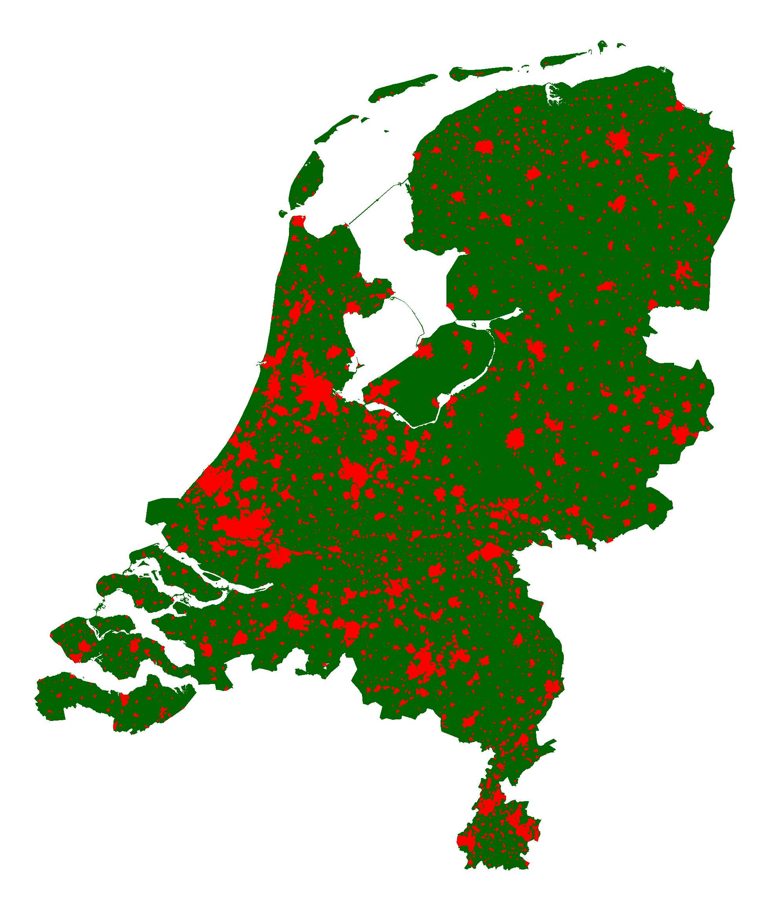
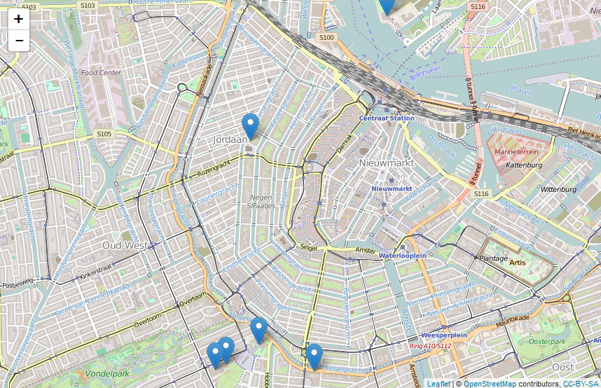

\thispagestyle{empty}

\newpage
\thispagestyle{empty}
\mbox{}
\newpage
\pdfbookmark{\contentsname}{toc}
\hypersetup{linkcolor=black}
\tableofcontents
\hypersetup{linkcolor=blue}
\newpage
\thispagestyle{empty}
\mbox{}
\newpage

# Voorwoord {-}
\markboth{Voorwoord}{}

Deze handleiding is speciaal samengesteld voor een presentatie over **R** op de 4e jaarlijkse OSGeo.nl dag (op de GeoBuzz) op woensdag 25 november 2015 in Den Bosch.

\newpage

# Het Project R

## Inleiding

**R** is een softwarepakket en een ontwikkelomgeving voor statistische berekeningen en het weergeven van grafieken.  De titel van de homepage van de website van **R** (<https://www.r-project.org/>) luidt dan ook: **The R Project for Statistical Computing**.

**R** is een populaire toepassing voor onderzoekers en analisten op allerlei terreinen, en wordt vaak genoemd in relatie met termen als *Big Data* en *Data Science*.

In deze handleiding zullen we laten zien dat **R** ook heel goed overweg kan met geografische data, dat wil zeggen gegevens waar een geografisch object aan gekoppeld is.

### Een korte geschiedenis van R

De ontwikkeling van **R** begint in de vroege jaren negentig van de vorige eeuw. De ontwikkelaars van het eerste uur zijn Ross Ihaka en Robert Gentleman. Zij ontmoeten elkaar voor het eerst in 1990 op het *Department of Statistics* van de *University of Auckland* (Nieuw-Zeeland). Zij halen een deel van hun inspiratie uit **S**, een programmeertaal die ontwikkeld is in de laboratoria van Bell. Bij wijze van grap noemen Ihaka en Gentleman hun taal **R**. Dat is immers niet alleen de letter die in het alfabet precies voor de S komt, maar tevens de eerste letter van hun beider voornamen.

Al kort na het uitbrengen van een vroege versie in 1994 sporen collega's van over zee hen aan om de broncode van deze nieuwe programmeertaal vrij te geven. Aangezien ze inschatten dat de vooruitzichten van **R** als commerciëel product slechts beperkt zijn, brengen ze hun geesteskind inderdaad uit als 'vrije software', onder de GPL licentie van de *Free Software Foundation*. Vanaf dat moment kan **R** gratis gedownload worden. Ook wordt er een discussielijst opgezet, waarop gebruikers over de verdere ontwikkeling van **R** mee kunnen praten.

En daarmee wordt een spectaculaire groei in gang gezet. Al snel kunnen Ihaka en Gentleman het niet meer samen aan en wordt het ontwikkelteam uitgebreid met een select gezelschap van programmeurs die direct toeganghebben tot de broncode - met schrijfrechten. In dit kernteam van ongeveer 20 man zitten een aantal bekende onderzoekers op het gebied van statistiek.

Op 29 februari 2000 besluit men dat de programmeertaal voldoende functionaliteit heeft, en stabiel genoeg is, om over te gaan tot het vrijgeven van versie R-1.0.0 ([Ihaka, 2009](https://www.stat.auckland.ac.nz/~ihaka/downloads/Massey.pdf)).

##	R downloaden en installeren

Het eerste dat je moet doen om met **R** te kunnen werken is natuurlijk: het downloaden en installeren van de software.

**R** wordt niet op één centrale plaats aangeboden, maar is beschikbaar via een uitgebreid netwerk van zogeheten *mirror sites* onder de naam **CRAN**, het **Comprehensive R Archive Network**. Dit is een wereldwijd netwerk van servers - vaak van universiteiten - waarop identieke en actuele versies van de software staan opgeslagen.

Vanuit het **CRAN** wordt het vriendelijke verzoek gedaan om voor het downloaden een server in de buurt te gebruiken, om het netwerk niet te zwaar te belasten. Daarom hebben we gekozen voor de server van de Universiteit Utrecht:
<http://cran-mirror.cs.uu.nl/>.

Op de downloadpagina moet je eerst een keuze maken voor **R** voor het juiste besturingssysteem. Voor het schrijven van deze handleiding maken we gebruik van een 64-bit Windows 7 machine, dus wij kiezen **R for Windows**. Vanzelfsprekend is **R** ook beschikbaar voor (Mac) OS X en voor Linux (vaak al opgenomen in de distributie).

Op de volgende pagina selecteren we de **base distribution**, want, zoals de website zegt: *dit is wat jij wilt als je **R** voor de eerste keer installeert*.

Op het moment van schrijven is versie 3.2.2 van 14 augustus 2015 de meest recente release van **R**. Maar de ontwikkelingen gaan snel, dus wellicht is er al een nieuwere versie beschikbaar als je dit leest. Zorg ervoor dat je  de laatste versie downloadt.

Dubbelklik na het downloaden op het bestand **R-X.X.X-win.exe** om de installatie te starten. (Op dit moment is dat *R-3.2.2-win.exe*.) 

\tcbset{coltitle=black, colbacktitle=white, colframe=gray!75!black,colback=white,nobeforeafter}
\begin{tcolorbox}[enlarge by=5mm, hyphenationfix, title=Codenaam]
Elke nieuwe versie van \textbf{R} krijgt naast een nummer ook een codenaam. Zo heet versie 3.2.2  \textbf{Fire Safety}. Voorbeelden van enkele codenamen uit het verleden zijn:  \textbf{Spring Dance} (3.0.3),  \textbf{Security Blanket} (2.15.3),  \textbf{Trick or Treat} (2.15.2) en  \textbf{December Snowflakes} (2.14.1).\par
En ook de release die jij hebt geïnstalleerd  heeft een bijzonder codenaam. Deze verschijnt in de console als je \textbf{R} opstart.
\end{tcolorbox}

Tijdens het installatieproces kun je - afhankelijk van het besturingssysteem - kiezen of je de 32-bit of de 64-bit versie wilt installeren. Als je geen keuze maakt, dan worden beide versies geïnstalleerd.

\begin{figure}[!htb]
\centering
\includegraphics{images/Rondesktop.png}
\caption{R op het bureaublad}
\label{Rondesktop}
\end{figure}

Na het voltooien van de installatie kun je **R** opstarten. In de afbeelding hieronder zie je de **RGui** met daarin de **R Console**.

\begin{figure}[!htb]
\includegraphics{images/RGUI.png}
\caption{De grafische gebruikersinterface van R}
\label{RGUI}
\end{figure}


Voor nu kiezen we er voor om **R** direct te verlaten door *q()* te typen achter de prompt.

```{r eval=FALSE}
q()
```

## RStudio downloaden en installeren

In de vorige paragraaf hebben we **R** direct na het opstarten weer afgesloten. En niet zonder reden. Om goed met **R** te kunnen werken gaan we eerst nog **RStudio** installeren.

**RStudio** is een **IDE**, een *integrated development environment* ofwel een geïntegreerde ontwikkelomgeving, die het werken met **R** op een aantal punten veel gemakkelijker maakt. Het is niet strikt noodzakelijk om **RStudio** te installeren. Je kan ook met **R** werken zonder deze toevoeging, maar zoals gezegd: het leven van een **R** programmeur wordt zoveel makkelijker met **RStudio**. Daarom zullen wij in deze handleiding gebruik maken van deze omgeving.       

\begin{tcolorbox}[enlarge by=5mm, hyphenationfix, title=Productiviteit]
RStudio bied een grote hoeveelheid functionaliteiten om de productiviteit van een \textbf{R} programmeur te verhogen.\par
Twee belangrijke voorbeelden hiervan zijn:
\begin{itemize}
\item \textbf{Syntax Highlighting} (in het Nederlands \textit{syntaxiskleuring} of \textit{accentuering}): door het gebruik van verschillende kleuren tekst is de structuur van de code gemakkelijker te doorgronden, en zijn syntaxisfouten gemakkelijker op te sporen.
\item \textbf{Code Completion}: RStudio biedt automatische aanvulling bij het schrijven van code, zowel voor namen van objecten die eerder gedefinieerd zijn, als voor functies en functieargumenten.
\end{itemize}
Na kennismaking met RStudio wil je nooit meer terug naar de RGui zoals we die in de vorige paragraaf hebben gezien.
\end{tcolorbox}       

Let op: **RStudio** is geen vervanging, maar draait bovenop **R**. Dus je moet er voor zorgen dat **R** eerst is geïnstalleerd voordat je de studio toevoegt.

Ga naar de website <https://www.rstudio.com/> en klik op de button **Download RStudio**. We zijn op zoek naar de gratis desktop versie.

Op het moment van schrijven is versie 0.99.489 van 5 november 2015 de meest recente release van **RStudio**. Maar ook hier geldt dat er hoogstwaarschijnlijk al een nieuwere versie beschikbaar is als je dit leest.

Dubbelklik na het downloaden op het bestand **RStudio-X.XX.XXX.exe** om de installatie te starten. (Op dit moment is dat *RStudio-0.99.489.exe*.)

\begin{figure}[!htb]
\centering
\includegraphics{images/RStudioondesktop.png}
\caption{RStudio op het bureaublad}
\label{RStudioondesktop}
\end{figure}


\newpage

### De RStudio gebruikersinterface

Na het voltooien van de installatie kun je **RStudio** opstarten. De interface van RStudio bestaat uit verschillende schermen (zie Figuur \ref{RStudioGUI}).

+ **Linksonder:** hier zie je het *Console* venster. Dit is de commandoregel van **R**. Achter de prompt (**>**) kun je commando's ingeven die worden uitgevoerd door **R**, zodra je een \<ENTER\> hebt gegeven. En dit is ook de plek waar **R** waarschuwingen en/of foutmeldingen zal afdrukken.

+ **Linksboven:** zodra je een nieuw **R** Script aanmaakt, of een bestaand script opent, dan wordt dat bestand hier in de linkerbovenhoek getoond. En ook het venster van de *Data Viewer* wordt hier getoond.

+ **Rechtsboven:** op het tabblad **Environment** welke objecten en welke waarden **R** in het geheugen heeft. Ook kun je hier zien welke packages geladen zijn. Op het tabblad **History** kun je naar eerder ingevoerde commando's zoeken, en deze eventueel hergebruiken.

+ **Rechtsonder:** hier in der rechteronderhoek vind je vijf verschillende tabbladen:
    + **Files:** hier kun je door het bestandssysteem bladeren
    + **Plots:** in dit venster worden je plots, dat wil zeggen: de grafieken en de kaartjes, getoond. (En RStudio houdt een geschiedenis bij van eerder gemaakte plots.)
    + **Packages:** hier kun je packages ('bibliotheken') installeren en of laden.
    + **Help:** Altijd nuttig :-)
    + **Viewer:** op dit tabblad wordt lokale webinhoud getoond (bijvoorbeeld als je - later in dit boek - met de bibliotheek `leaflet` aan de slag gaat).


\begin{figure}[!htb]
\includegraphics{images/RStudio.png}
\caption{De grafische gebruikersinterface van RStudio}
\label{RStudioGUI}
\end{figure}

\newpage

## Packages, packages, packages... (ook wel: bibliotheken)

**R** is modulair opgebouwd. Er is het basissysteem, zoals we dat in de vorige paragrafen hebben geïnstalleerd. Maar daar bovenop zijn er vele aanvullende bibliotheken, zogeheten *packages*, beschikbaar.

Door middel van een *package* wordt extra functionaliteit toegevoegd aan **R**. Er zijn in de loop der jaren veel van dergelijke bibliotheken aan het **Comprehensive R Archive Network** toegevoegd, met bijdragen van wetenschappers en programmeurs van over de hele wereld. Ook vanuit Nederland. 

Tijdens een presentatie in oktober 2009 kon Ross Ihaka nog 'opscheppen' dat er al meer dan 1.700 *packages* aan het **CRAN** waren toegevoegd ([Ihaka, 2009](https://www.stat.auckland.ac.nz/~ihaka/downloads/Massey.pdf)), maar nu - november 2015, dus zes jaar later - staat de teller al op het aantal van 7.488 bijdragen (Zie: <https://cran.r-project.org/web/packages/>).     

Ook voor het uitvoeren van geografische analyses met  **R** zijn vele bibliotheken beschikbaar. Voor een overzicht, zie: [CRAN Task View: Analysis of Spatial Data](https://cran.r-project.org/web/views/Spatial.html).

In de volgende hoofdstukken zullen we telkens één of meer van deze bibliotheken introduceren. De rode draad in de rest van het boek is dan ook: *Packages, packages, packages...* (Overigens heeft deze handleiding niet de pretentie om alle 'geografische' bibliotheken te behandelen. Er is altijd meer dan men in één boek kan samenvatten.)

Als je op zoek bent naar bepaalde functionaliteit die niet beschikbaar is in basis-**R**, dan is de kans groot dat een aanvullende bibliotheek uitkomst biedt. En anders wordt je van harte uitgenodigd om zelf een *package* te schrijven en met de gemeenschap te delen.

### `install.packages()`

Om een bibliotheek te kunnen gebruiken, moet je hem eerst - éénmalig - installeren. Dit kan heel eenvoudig vanuit **RStudio** zelf. Bijvoorbeeld:

```{r eval=FALSE}
install.packages("rgdal") # met aanhalingstekens
```

Zoals je ziet wordt de benodigde software automatisch gedownload en geïnstalleerd.

### `library()`

Om een funcite uit een bepaalde bibliotheek te kunnen gebruiken, moet je deze bibliotheek eerst laden. En dit moet elke keer dat je **R** gebruikt opnieuw gebeuren. Bijvoorbeeld:

```{r eval=FALSE}
library(tmap) # zonder aanhalingstekens
```

Als je een (fout)melding krijgt dat een bepaalde functie onbekend is, dan kan dat komen doordat je de benodigde bibliotheek niet geladen hebt.

In **R** scripts zie je vaak bovenaan één of meerdere `library()` statements staan, zodat de benodigde bibliotheken geladen worden voordat de rest van het script wordt uitgevoerd.

\newpage

# Het werken met geografische gegevens in R \label{chsp}

## De bibliotheek `sp`

Het package `sp` is een belangrijk element voor het gebruik van geografische data in **R**. Deze bibliotheek biedt een aantal klassen en methoden voor het verwerken van deze gegegevens. Zo zijn er ruimtelijke datastructuren gedefinieerd voor het opslaan van punt-, lijn- en vlakobjecten, en voor rasterdata, al dan niet met daaraan gekoppelde attribuutgegevens.

De bouwstenen - dat wil zeggen de klassen en methoden - die deze bibliotheek aanlevert, worden door vele andere geografische **R** packages gebruikt, zowel direct als indirect. En dat was precies de bedoeling van de auteurs, Edzer Pebesma en Roger Bivand, toen zij rond 2003 met de ontwikkeling van deze package begonnen.

**R** is oorspronkelijk ontwikkeld als programmeertaal voor èn door statistici, maar omdat (bijna) elk gegeven ook een ruimtelijke component heeft (*"Waar?"*), was er al snel ook belangstelling voor deze taal vanuit geografische hoek. En door de modulaire opbouw van **R** was het mogelijk om GIS functionaliteit toe te voegen door middel van een zelf te bouwen package. Maar de ontwikkeling van deze geografische bibliotheken werd belemmerd doordat er geen gemeenschappelijk ruimtelijk raamwerk was; elke package had zijn eigen regels voor het opslaan en verwerken van geodata. Om aan deze wildgroei een einde te maken hebben Pebesma en Bivand de hadschoen opgepakt, en een aantal zaken éénduidig vastgelegd in hun bibliotheek. Hiermee hebben ze het mogelijk gemaakt dat de analyse van geografische gegevens met **R** op een veel meer coherente wijze kan worden uitgevoerd ([Pebesma en Bivand, 2005](https://cran.r-project.org/web/packages/sp/vignettes/intro_sp.pdf)).

\begin{tcolorbox}[enlarge by=5mm, hyphenationfix, title=De bocht in de Maas]
    \begin{minipage}[t]{0.25\linewidth}
    \vspace*{0pt}
        \includegraphics[height=6.03cm,width=2.61cm]{images/Meuse.png}
    \end{minipage}
    \begin{minipage}[t]{0.75\linewidth}
    \vspace*{0pt}
        Met \textbf{R} worden een aantaal oefendatasets meegeleverd, handig voor onderwijs- en demonstratiedoeleinden. Zo zul je vaak \textbf{R} oefeningen tegenkomen, waarin bijvoorbeeld de {\small\ttfamily{mtcars}} of de {\small\ttfamily{iris}} dataset wordt gebruikt.\par
        En ook bij het {\small\ttfamily{sp}} package zit een dergelijk oefenbestand: de \textit{Meuse river data set}. Deze set bevat gegevens over de locatie van concentraties van zware metalen (cadmium, koper, lood en zink) in de bodem van een overstromingsvlakte in een bocht van de Maas, ten westen van het Limburgse plaatsje Stein.  Deze gegevens zijn in 1993 verzameld door Ruud van Rijn and Mathieu Rikken, in het kader van hun afstudeerproject Fysische Geografie aan de Universiteit Utrecht.\par
        Deze data zijn door Edzer Pebesma - ook Fysisch Geograaf, in 1996 gepromoveerd aan dezelfde universiteit in Utrecht - toegevoegd aan 'zijn'  {\small\ttfamily{sp}} bibliotheek.\par
        Tegenwoordig is Pebesma hoogleraar aan de \textbf{Westfälische Wilhelms-Universität (WWU)} in Münster (Duitsland), waar hij directeur is van het \textbf{Institut für Geoinformatik}.
    \end{minipage}\hfill%
    Zie voor voorbeelden waarin deze Maasdata worden gebruikt:\par
    \url{http://rspatial.r-forge.r-project.org/gallery/}
\end{tcolorbox}

Zie voor meer informatie over de bibliotheek `sp` de handleiding op het CRAN:

<https://cran.r-project.org/web/packages/sp/sp.pdf>.

\newpage

## Het aanmaken van een `SpatialPointsDataFrame` - 1 \label{spdf}

In deze paragraaf gaan we kennismaken met één van de hiervoor genoemde ruimtelijke datastructuren. We gaan zelf een SpatialPointsDataFrame aanmaken, op basis van gegevens in een data.frame.

Begin met het installeren van de betreffende bibliotheek en laad deze in het geheugen:

```{r eval=FALSE}
install.packages("sp") #éénmalig
library(sp)
```

```{r echo=FALSE}
library(sp)
```

Het [invoerbestand](http://www.twiav.nl/files/NL_Museums_Amsterdam.csv) is een lijstje met enkele bezienswaardigheden in Amsterdam, met bijbehorende x- en y-coördinaten. Dit [bestand](http://www.twiav.nl/files/NL_Museums_Amsterdam.csv) is online beschikbaar en staat op [deze lokatie](http://www.twiav.nl/files/NL_Museums_Amsterdam.csv). 

Overigens hoef je dit bestand niet te downloaden en op te slaan. Je kan het direct inlezen vanaf de huidige lokatie.

```{r}
URL <- "http://www.twiav.nl/files/NL_Museums_Amsterdam.csv"
ams.df <- read.csv(URL)
ams.df
```
Bekijk van welke klasse ams.df is:

```{r}
class(ams.df)
```
De kolommen 3 en 4 bevatten de coordinaatinformatie (x en y). Deze kun je op de volgende wijze selecteren:

```{r}
ams.df[3:4]
```

En de eerste twee Kolommen bevatten attribuutgegevens. Deze kun je desgewenst ook even bekijken: `ams.df[1:2]`

Met deze informatie kunnen we nu een geografisch object maken:

```{r}
ams.spdf <- SpatialPointsDataFrame(coords = ams.df[3:4], data = ams.df[1:2])
ams.spdf
```

Bekijk van welke klasse ams.spdf is:

```{r}
class(ams.spdf)
```

En vraag de samenvatting op:
```{r}
summary(ams.spdf)
```

**Dat ziet er goed uit.**

\newpage

### Plot

In de vorige paragraaf hebben we een SpatialPointsDataFrame aangemaakt, en nu gaan we dit plotten, om te zien hoe dat er uit ziet.

De snelste manier is:

```{r eval=FALSE}
plot(ams.spdf)
```

Dit geeft wel een erg saai kaartbeeld. Dat moet beter kunnen. Na wat experimenteren en uitzoeken zou je tot het volgende commando kunnen komen:

```{r eval=FALSE}
plot(ams.spdf, pch = 19, col = "blue", axes = TRUE,
     main = "Enkele bezienswaardigheden in Amsterdam")
```

Je wordt hier uitgenodigd om gebruik te gaan maken van het uitgebreide helpsysteem dat bij **R** hoort, om uit te zoeken wat de verschillende parameters precies doen.

Je kunt tekstlabels toevoegen aan de musea met onderstaande opdracht:

```{r eval=FALSE}
text(coordinates(ams.spdf), as.character(ams.spdf$Name),
     cex = .7, pos = 4, col = "blue")
```

Doordat alle tekstlabels rechts van het museum staan ontstaat op het Museumplein enige overlap.

Dit kunnen we oplossen door niet één generieke positie (`pos = 4`) voor alle labels op te geven, maar door een vector aan te maken waarin ieder museum een eigen labelpositie krijgt, zodat we kunnen variëren.

Maak een vector aan met (initieel) voor elk museum de waarde 4. En bekijk de inhoud van deze vector:

```{r}
pos.vector <- rep(4, length(ams.spdf))
pos.vector
```

Ken nu een andere waarde toe voor het Stedelijk:

```{r}
pos.vector[ams.spdf$Name == "Stedelijk Museum"] <- 2
pos.vector
```

Plot opnieuw - nu met labels op goede plaats:

```{r amsplot, fig.cap='een voorbeeld van een plot', fig.align='default', fig.show='asis'}
plot(ams.spdf, pch = 19, col = "blue", axes = TRUE,
     main = "Enkele bezienswaardigheden in Amsterdam")
text(coordinates(ams.spdf), as.character(ams.spdf$Name),
     cex = .6, pos = pos.vector, col = "blue")
```

## Het toekennen van een CRS (*Coordinate Reference System*)

Het SpatialPointsDataFrame dat we in de vorige paragraaf (\ref{spdf}) hebben aangemaakt, is nog niet helemaal compleet, omdat we er nog geen coördinaatreferentiesysteem (CRS) aan hebben toegekend. Het Frame heeft weliswaar coördinaten, maar we hebben nog niet vastgelegd hoe deze aan een plek op aarde te relateren zijn.

Er zijn twee soorten coördinaatsystemen:

+ **ongeprojecteerd/geografisch**: in een dergelijk systeem wordt dor middel van lengte- en breedtegraden een positie op de aarde weergegeven,
+ **geprojecteerd**: in een projectie wordt een gedeelte van het aardoppervlak weergegeven in een 2-dimensionaal vlak.

Een bekend, en tegenwoordig alom gebruikt systeem van het eerste soort is WGS84. Het officiële Nederlandse systeem - het Rijksdriehoeksstelsel (zie paragraaf \ref{RDM}) - is een voorbeeld van het tweede type.

Het toekennen van een CRS gaat door middel van een `proj4string`, een lange ingewikkelde string met geodetische parameters. In de samenvatting die we eerder hebben opgevraagd - met `summary(ams.spdf)` - zagen we al dat er aan onze data nog geen CRS was toegekend: `proj4string : [NA]`.

Gelukkig hebben veel projecties tegenwoorig een zogeheten *EPSG* code, waardoor het makkelijker wordt om een `proj4string` toe te kennen.

\begin{tcolorbox}[enlarge by=5mm, hyphenationfix, title=EPSG?]
Het was de \textbf{European Petroleum Survey Group} die het initiatief heeft genomen de vele wereldwijd gebruikte coördinaatsystemen elk van een eigen, unieke code te voorzien, om de communicatie over locaties te vergemakkelijken. Het moge duidelijk zijn dat de (financiële) belangen van de olieindustrie hier groot zijn; men kan het zich simpelweg niet permitteren om op een verkeerde plek te gaan boren.\par
Hoewel de EPSG als organisatie al niet meer bestaat, wordt de EPSG Dataset nog steeds onderhouden door de  International Association of Oil \& Gas Producers (IOGP), tot voordeel van ons allen. Zie \url{http://www.epsg.org/}
\end{tcolorbox} 

Nu is natuurlijk de vraag: welk coördinaatsysteem gaan we aan onze data koppelen? Op die vraag is maar één antwoord mogelijk, namelijk: het juiste CRS. Je kunt immers niet zomaar een willekeurige referentie aan de gegevens hangen.

Dit betekent dat er altijd duidelijk moet zijn welk CRS bij geografische data hoort. Dit kan in de metadata staan, of het moet worden aangegeven door de dataleverancier.

De `x` en `y` van onze Amsterdamse museumdataset zijn gegeven in Nederlandse RD-coördinaten. De *EPSG* code van dit systeem is 28992.

Nu we dit weten kunnen we het CRS toekennen:

```{r}
proj4string(ams.spdf) <- CRS("+init=epsg:28992")
summary(ams.spdf)
```

\twocolumn

### Het Nederlandse coördinaatsysteem: het stelsel van de Rijksdriehoeksmeting \label{RDM}

In Nederland worden de meeste geografische data uitgewisseld in RD-coördinaten. De EPSG code voor het RD-stelsel is 28992.

Het Rijksdriehoeksstelsel is het nationale geodetische triangulatiesysteem van Nederland. De basis van dit systeem is een stereografische kaartprojectie gecentreerd op de spits van de Onze Lieve Vrouwetoren in Amersfoort. Op het zo verkregen projectievlak is een cartesiaans assenstelsel geconstrueerd. De voor het RD-stelsel gebruikte stereografische projectie is gebaseerd op de ellipsoïde van Bessel (1841). Een belangrijk voordeel van de projectie is, dat deze *conform* (hoekgetrouw) is: een hoek gemeten in de kaart is gelijk aan de werkelijke hoek. Voor een klein gebied als Nederland kan men gebruik maken van een dergelijke projectie, al nemen de afstandsfouten wel toe, naarmate men verder van de oorsprong verwijderd raakt.

De oorsprong van het systeem ligt in Amersfoort. Aanvankelijk was deze oorsprong ook het nulpunt (X=Y=0) van het systeem. Dit betekende dat men in het noordoosten van Nederland met positieve X- en Y-coördinaten kon werken, maar dat men in de andere delen van het land rekening moest houden met een negatieve X- en/of een negatieve Y-coördinaat. Om dit probleem op te lossen heeft men in het begin van de jaren zeventig van de twintigste eeuw het nulpunt verschoven, en wel 155 kilometer naar het westen en 463 kilometer naar het zuiden. Nederland ligt nu in zijn geheel in het eerste kwadrant van het assenstelsel, en door de extreem grote Y-verschuiving is de grootst voorkomende X-waarde nog altijd kleiner dan de kleinst mogelijke Y-waarde. Daardoor zijn alle voorkomende coördinaten nu positief, en de X- en Y-waarden zijn goed uit elkaar te houden (zie figuur \ref{afbRD}).

Het geldigheidsgebied voor de RD-coördinaten is nauwkeurig gedefinieerd. Globaal mogen deze coördinaten alleen gebruikt worden op het Nederlandse vasteland en in een kleine band daaromheen. Daar valt niet het gehele Nederlandse Continentaal Plat (het Nederlandse deel van de Noordzee) binnen. In België en Duitsland maakt men gebruik van andere coördinaatsystemen.

Voor meer achtergrondinformatie over de geodetische referentiestelsels van Nederland, zie: [De Bruijne et al. (2005)](http://www.ncgeo.nl/phocadownload/43Referentie.pdf).

\begin{tcolorbox}[enlarge by=5mm, hyphenationfix, title=De belangrijkste kenmerken van het RD-stelsel zijn:]
\begin{itemize}
\item stereografische projectie
\item conform (hoekgetrouw)
\item alleen bruikbaar voor het Nederlandse Grondgebied
\item alle coördinaatgetallen zijn positief
\item Y-coördinaat is altijd groter dan X-coördinaat
\item meeteenheid: meters
\item EPSG:28992
\end{itemize}
\end{tcolorbox}       


\onecolumn

\begin{figure}[!htb]
\includegraphics{images/RD.png}
\caption{De coördinaten van het Rijksdriehoeksstelsel}
\label{afbRD}
\end{figure}

\newpage

## Het aanmaken van een `SpatialPointsDataFrame` -2

### direct met `CRS`

**Let op:** het toekennen van het CRS hoeft niet in een aparte stap te gebeuren.Je kunt dit ook direct doen bij het aanmaken van het SpatialPointsDataFrame:

```{r}
ams.spdf <- SpatialPointsDataFrame(coords = ams.df[3:4],
                          data = ams.df[1:2], proj4string = CRS("+init=epsg:28992"))
```

### alternatieve syntaxis

In de voorgaande paragrafen hebben op de volgende manier een SpatialPointsDataFrame gecreëerd:

```{r}
URL <- "http://www.twiav.nl/files/NL_Museums_Amsterdam.csv"
ams.df <- read.csv(URL)
ams.spdf <- SpatialPointsDataFrame(coords = ams.df[3:4],
                          data = ams.df[1:2], proj4string = CRS("+init=epsg:28992"))
```

In deze paragraaf gaan we het op een iets andere manier doen.

1. Het is niet noodzakelijk om twee verschillende objecten - in het voorbeeld `ams.df` en `ams.spdf` - te gebruiken. Je kunt ook een object zelf omzetten van data.frame naar SpatialPointsDataFrame,
2. We gaan een alternatieve syntaxis gebruiken voor het aanwijzen van de coördinaten.


```{r}
URL <- "http://www.twiav.nl/files/NL_Museums_Amsterdam.csv"
mus <- read.csv(URL)
class(mus)
coordinates(mus) <- ~x+y
class(mus)
proj4string(mus) <- CRS("+init=epsg:28992")
```

Het object `mus` is identiek aan het object `ams.spdf`. Dit kun je controleren door de samenvatting op te vragen: `summary(mus)`.

Welke code beter is? Ach, dat is vaak een persoonlijke keuze van de programmeur; een kwestie van smaak. En, zoals de oude Romeinen zeiden: *De gustibus non est disputandum*.

\newpage

## Een dataset herprojecteren met `spTransform()`

Het zal regelmatig voorkomen dat je een dataset met een bepaald CRS hetbt, terwijl voor de actie die je wilt uitvoeren een ander CRS noodzakelijk is. Gelukkig is het vrij eenvoudig om data te transformeren van het ene naar het andere CRS, op voorwaarde natuurlijk dat je de definitie van het doel-CRS kent.

Bijvoorbeeld: wij willen later in deze handleiding onze Amsterdamse musea op een OpenStreetMap kaart tonen (zie hoofdstuk \ref{chLflt}). Hiervoor is het noodzakelijk dat de coördinaten worden getransformeerd naar WGS84. Gelukkig kennen wij de *EPSG* code van dit CRS, namelijk EPSG:4326.

In het voorbeeld hieronder maken we een nieuw object aan, waarbij de coördinaten uit `ams.spdf` worden overgezet naar WGS84. Bekijk de `coordinates` van `ams.spdf.wgs84`: dit zijn nu geen meters meer, maar decimale graden.

```{r}
ams.spdf.wgs84 = spTransform(ams.spdf, CRS("+init=epsg:4326"))
summary(ams.spdf.wgs84)
```

\newpage

# Het inlezen van geografische gegevens in R

## De bibliotheek `rgdal`

In dit hoofdstuk gaan we gegevens vanuit externe GIS bestanden inlezen in **R**. Dit doen we met de functie `readOGR` uit het *package* `rgdal`.

De bibliotheek `rgdal` biedt toegang vanuit **R** tot de functionaliteit van **GDAL**. Voordat we deze installatie gaan uitvoeren, geven we eerst wat informatie over de kracht van **GDAL**.

### GDAL

**GDAL** staat voor *Geospatial Data Abstraction Library*. Deze bibliotheek biedt abstracte gegevensmodellen voor geografische gegevens, één voor het raster- en één voor het vectorformaat. Daarnaast bevat **GDAL** een hoeveelheid programma's, zoals bijvoorbeeld `ogr2ogr`, `ogrinfo`, `gdaldem` en `gdal_contour`, voor het bewerken van geografische data. Deze programma's zijn zogeheten *command line utilities* (dat wil zeggen: ze moeten via de commandoregel worden aangesproken) en bieden vele opties voor onder andere:

* het inlezen en wegschrijven van geografische bestanden;
* het converteren van bestanden van het ene naar het andere geografische formaat (bijvoorbeeld van ESRI SHP naar GeoJSON);
* het herprojecteren van geografische bestanden (bijvoorbeeld van het Nederlandse RD-stelsel, EPSG:28992, naar WGS84, EPSG:4326);
* het analyseren en visualiseren van digitale hoogtemodellen en het genereren van contourlijnen;
* etc., etc.

**GDAL** wordt zowel gebruikt door Geo-ICT professionals, voor het - via de commandoregel - bewerken van geografische bestanden, als door programmeurs die op deze wijze geografische functionaliteit aan hun applicaties toe kunnen voegen.

De bibliotheek is oorspronkelijk ontwikkeld door Frank Warmerdam, maar tegenwoordig is de ontwikkeling en het onderhoud van **GDAL** ondergebracht bij de **Open Source Geospatial Foundation** (<http://www.osgeo.org/>).

Meer informatie over **GDAL** is te vinden op de website <http://www.gdal.org/>.

### `install.packages("rgdal")`

`rgdal` maakt geen onderdeel uit van de basisinstallatie van **R**, dus we zullen dit *package* zelf moeten toevoegen. Gelukkig is het installeren van *packages* in **R** kinderlijk eenvoudig. Dit doe je met de functie `install.packages()`.

Typ achter de prompt het volgende commando:

```{r eval=FALSE}
install.packages("rgdal")
```

Je ziet nu in de console dat de gevraagde bibliotheek automatisch wordt gedownload en geïnstalleerd. Overigens maakt `rgdal` gebruik van ruimtelijke klassen die in een andere *package*, namelijk `sp`, zijn gedefiniëerd. Deze afhankelijkheid wordt automatisch gedetecteerd. Vandaar dat je in de console ziet staan dat `sp` ook is opgehaald en geïnstalleerd: `also installing the dependency 'sp'`.

\newpage

# Interactieve kaartvensters in R \label{chLflt}

## De bibliotheek `leaflet`

Leaflet (<http://leafletjs.com/>) is een open-source JavaScript bibliotheek voor het maken van interactieve kaarten. De functionaliteit van Leaflet wordt in **R** beschikbaar gemaakt via het package `leaflet`.  

Deze bibliotheek wordt onderhouden door [Joe Cheng](https://github.com/jcheng5) van RStudio, Inc.

In de oefeningen hieronder zullen we eerst stap voor stap een Leafletkaart maken. Daarna zullen we de *pipe operator* (`%>%`) introduceren, waarmee de code vereenvoudigd kan worden.

Zie voor meer informatie over de bibliotheek `leaflet`

* de handleiding op het CRAN: <https://cran.r-project.org/web/packages/leaflet/leaflet.pdf>.

## Een interactieve kaart - 1: stap voor stap

Ter voorbereiding laden we onze Amsterdamse musea weer (zie hoofdstuk \ref{chsp}):

```{r}
library(sp)
URL <- "http://www.twiav.nl/files/NL_Museums_Amsterdam.csv"
mus <- read.csv(URL)
coordinates(mus) <- ~x+y
proj4string(mus) <- CRS("+init=epsg:28992")
```

Stap 1: het aanmaken van een Leaflet map widget:

```{r echo=FALSE}
library(leaflet)
ikaart <- leaflet()
```


```{r eval=FALSE}
ikaart <- leaflet()
ikaart
```
Dit geeft een leeg kaartvenster in de **Viewer** tab.

Stap 2: het toevoegen van de OpenStreetMap kaartlaag:

```{r echo=FALSE}
ikaart <- addTiles(ikaart)
```


```{r eval=FALSE}
ikaart <- addTiles(ikaart)
ikaart
```

Stap 3: het toevoegen van onze eigen laag (let op: de gegevens worden *on the fly* geconverteerd van epsg:28992 naar epsg:4326):

```{r echo=FALSE}
ikaart <- addMarkers(ikaart, data = spTransform(mus, CRS("+init=epsg:4326")), popup = mus$Name)
```


```{r eval=FALSE}
ikaart <- addMarkers(ikaart,
                     data = spTransform(mus, CRS("+init=epsg:4326")), popup = mus$Name)
ikaart
```

*Et voilà!* De afbeelding in deze bundel is zo statisch als wat. Maar de kaart in de **Viewer** tab is echt interactief: je kunt inzoomen, uitzoomen en pannen. Vergeet ook niet op de markers te klikken om de tooltip te controleren. 




## Een interactieve kaart - 2: met de *pipe operator* (`%>%`)

In de vorige paragraaf hebben we in 3 stappen een kaart - `ikaart` - gemaakt:

```{r eval=FALSE}
ikaart <- leaflet()
ikaart <- addTiles(ikaart)
ikaart <- addMarkers(ikaart,
                     data = spTransform(mus, CRS("+init=epsg:4326")), popup = mus$Name)
```

Hierbij diende telkens de uitvoer van een functie als invoer voor de volgende stap: eerst wordt `ikaart` gevuld met een lege htmlwidget, vervolgens dient `ikaart` als invoer voor de functie `addTiles()` om de OSM laag toe te voegen, en dan wordt `ikaart` nog een keer ingevoerd in de functie `addMarkers`...

Deze 3 stappen kunnen worden teruggebracht tot één met behulp van de *pipe operator*, het symbool: `%>%`

Met deze operator kun je de uitvoer van een functie doorgeven aan de volgende, zodat je functies als het ware aan elkaar kunt reigen. En dat ziet er dan zo uit:

```{r eval=FALSE}
ikaart2 <- leaflet() %>%
  addTiles() %>%
  addMarkers(data = spTransform(mus, CRS("+init=epsg:4326")), popup = mus$Name)
ikaart2
```

Dit geeft dezelfde kaart als net.

Daarmee leidt het gebruik van de deze operator tot code die èn beter leesbaar is, en makkelijker te onderhouden.

De pipe operator is een relatief nieuw fenomeen in **R**; hij bestaat pas sinds 2014 en is ontwikkeld door Stefan Milton in zijn `magrittr` package. (Nee, inderdaad: je hebt dit `magrittr` package niet zelf geïnstalleerd - maar het is geïmporteerd door `leaflet`, een bibliotheek die je wel hebt draaien.)

Zie voor meer informatie over de bibliotheek `magrittr`

* de handleiding op het CRAN: <https://cran.r-project.org/web/packages/magrittr/magrittr.pdf>,
* deze vignette: <https://cran.r-project.org/web/packages/magrittr/vignettes/magrittr.html>


\begin{figure}[!htb]
\centering
\includegraphics{images/logo.png}
\caption{het 'officiële' logo van het magrittr package}
\label{MagrittrLogo}
\end{figure}


## Een interactieve kaart - 3: een uitgebreid script

Voor de oefening in deze paragraaf verwijzen we naar het volgende blog:
[Maak een interactief kaartvenster in R/RStudio met leaflet](http://www.twiav.nl/nl/blog0005.php).

Hier vind je een uitgebreid script - [InteractiefKaartvensterInRStudio.R](http://www.twiav.nl/nl/InteractiefKaartvensterInRStudio.R) - waarmee meerdere lagen aan een kaart worden toegevoegd, inclusief een bijbehorende *LayersControl*.


\newpage

# Literatuurlijst {-}
\markboth{Literatuurlijst}{}

+ De Bruijne, Arnoud, Van Buren, Joop, Kösters, Anton & Van der Marel, Hans (2005). *De geodetische referentiestelsels van Nederland; Definitie en vastlegging van ETRS89, RD en NAP en hun onderlinge relaties*.Nederlandse Commissie voor Geodesie (NCG), Delft, maart 2005. URL: <http://www.ncgeo.nl/phocadownload/43Referentie.pdf>

+ Frazier, Melanie (z.d.). *Overview of Coordinate Reference Systems (CRS) in R*. Geraadpleegd op 12 november 2015. URL: <https://www.nceas.ucsb.edu/~frazier/RSpatialGuides/OverviewCoordinateReferenceSystems.pdf> 


+ Ihaka, Ross (2009). *The R Project: A Brief History and Thoughts About the Future*. Presentatie gehouden op de Massey University Statistics Day, 23 oktober 2009, Massey University, Palmerston North. URL: <https://www.stat.auckland.ac.nz/~ihaka/downloads/Massey.pdf>

+ Pebesma, Edzer & Bivand, Roger S. (2005). *Classes and Methods for Spatial Data: the sp Package*. Eén van de vignettes behorende bij de `sp` bibliotheek. URL: <https://cran.r-project.org/web/packages/sp/vignettes/intro_sp.pdf>


