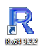
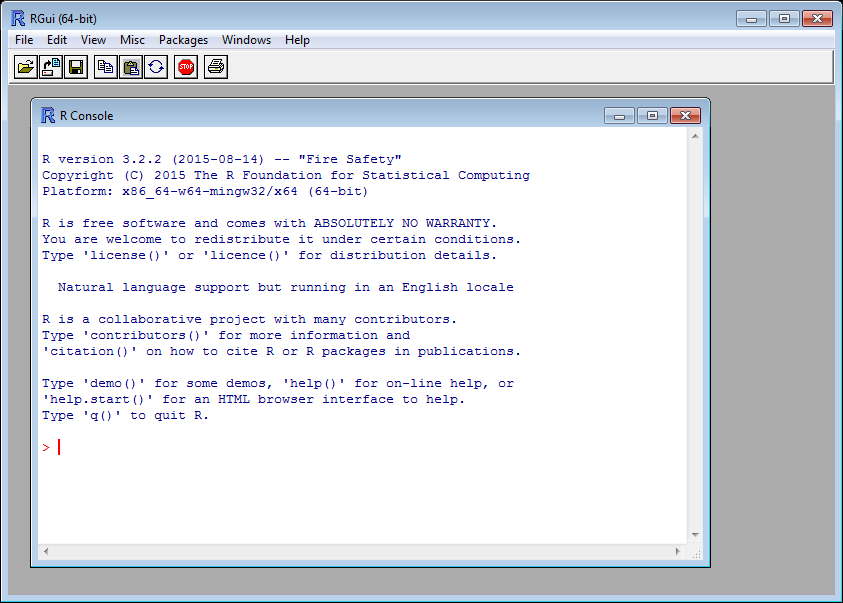
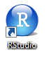

\thispagestyle{empty}

\newpage
\thispagestyle{empty}
\mbox{}
\newpage
\pdfbookmark{\contentsname}{toc}
\hypersetup{linkcolor=black}
\tableofcontents
\hypersetup{linkcolor=blue}
\newpage
\thispagestyle{empty}
\mbox{}
\newpage

# Voorwoord {-}
\markboth{Voorwoord}{}

Deze handleiding is speciaal samengesteld voor een presentatie over **R** op de 4e jaarlijkse OSGeo.nl dag (op de GeoBuzz) op woensdag 25 november 2015 in Den Bosch.

\newpage

# Het Project R

## Inleiding

**R** is een softwarepakket en een ontwikkelomgeving voor statistische berekeningen en het weergeven van grafieken.  De titel van de homepage van de website van **R** (<https://www.r-project.org/>) luidt dan ook: **The R Project for Statistical Computing**.

**R** is een populaire toepassing voor onderzoekers en analisten op allerlei terreinen, en wordt vaak genoemd in relatie met termen als *Big Data* en *Data Science*.

In deze handleiding zullen we laten zien dat **R** ook heel goed overweg kan met geografische data, dat wil zeggen gegevens waar een geografisch object aan gekoppeld is.

### Een korte geschiedenis van R

De ontwikkeling van **R** begint in de vroege jaren negentig van de vorige eeuw. De ontwikkelaars van het eerste uur zijn Ross Ihaka en Robert Gentleman. Zij ontmoeten elkaar voor het eerst in 1990 op het *Department of Statistics* van de *University of Auckland* (Nieuw-Zeeland). Zij halen een deel van hun inspiratie uit **S**, een programmeertaal die ontwikkeld is in de laboratoria van Bell. Bij wijze van grap noemen Ihaka en Gentleman hun taal **R**. Dat is immers niet alleen de letter die in het alfabet precies voor de S komt, maar tevens de eerste letter van hun beider voornamen.

Al kort na het uitbrengen van een vroege versie in 1994 sporen collega's van over zee hen aan om de broncode van deze nieuwe programmeertaal vrij te geven. Aangezien ze inschatten dat de vooruitzichten van **R** als commerciëel product slechts beperkt zijn, brengen ze hun geesteskind inderdaad uit als 'vrije software', onder de GPL licentie van de *Free Software Foundation*. Vanaf dat moment kan **R** gratis gedownload worden. Ook wordt er een discussielijst opgezet, waarop gebruikers over de verdere ontwikkeling van **R** mee kunnen praten.

En daarmee wordt een spectaculaire groei in gang gezet. Al snel kunnen Ihaka en Gentleman het niet meer samen aan en wordt het ontwikkelteam uitgebreid met een select gezelschap van programmeurs die direct toeganghebben tot de broncode - met schrijfrechten. In dit kernteam van ongeveer 20 man zitten een aantal bekende onderzoekers op het gebied van statistiek.

Op 29 februari 2000 besluit men dat de programmeertaal voldoende functionaliteit heeft, en stabiel genoeg is, om over te gaan tot het vrijgeven van versie R-1.0.0 ([Ihaka, 2009](https://www.stat.auckland.ac.nz/~ihaka/downloads/Massey.pdf)).

##	R downloaden en installeren

Het eerste dat je moet doen om met **R** te kunnen werken is natuurlijk: het downloaden en installeren van de software.

**R** wordt niet op één centrale plaats aangeboden, maar is beschikbaar via een uitgebreid netwerk van zogeheten *mirror sites* onder de naam **CRAN**, het **Comprehensive R Archive Network**. Dit is een wereldwijd netwerk van servers - vaak van universiteiten - waarop identieke en actuele versies van de software staan opgeslagen.

Vanuit het **CRAN** wordt het vriendelijke verzoek gedaan om voor het downloaden een server in de buurt te gebruiken, om het netwerk niet te zwaar te belasten. Daarom hebben we gekozen voor de server van de Universiteit Utrecht:
<http://cran-mirror.cs.uu.nl/>.

Op de downloadpagina moet je eerst een keuze maken voor **R** voor het juiste besturingssysteem. Voor het schrijven van deze handleiding maken we gebruik van een 64-bit Windows 7 machine, dus wij kiezen **R for Windows**. Vanzelfsprekend is **R** ook beschikbaar voor (Mac) OS X en voor Linux (vaak al opgenomen in de distributie).

Op de volgende pagina selecteren we de **base distribution**, want, zoals de website zegt: *dit is wat jij wilt als je **R** voor de eerste keer installeert*.

Op het moment van schrijven is versie 3.2.2 van 14 augustus 2015 de meest recente release van **R**. Maar de ontwikkelingen gaan snel, dus wellicht is er al een nieuwere versie beschikbaar als je dit leest. Zorg ervoor dat je  de laatste versie downloadt.

Dubbelklik na het downloaden op het bestand **R-X.X.X-win.exe** om de installatie te starten. (Op dit moment is dat *R-3.2.2-win.exe*.) 

\tcbset{coltitle=black, colbacktitle=white, colframe=gray!75!black,colback=white,nobeforeafter}
\begin{tcolorbox}[enlarge by=5mm, hyphenationfix, title=Codenaam]
Elke nieuwe versie van R krijgt naast een nummer ook een codenaam. Zo heet versie 3.2.2  \textbf{Fire Safety}. Voorbeelden van enkele codenamen uit het verleden zijn:  \textbf{Spring Dance} (3.0.3),  \textbf{Security Blanket} (2.15.3),  \textbf{Trick or Treat} (2.15.2) en  \textbf{December Snowflakes} (2.14.1).\par
En ook de release die jij hebt geïnstalleerd  heeft een bijzonder codenaam. Deze verschijnt in de console als je R opstart.
\end{tcolorbox}

Tijdens het installatieproces kun je - afhankelijk van het besturingssysteem - kiezen of je de 32-bit of de 64-bit versie wilt installeren. Als je geen keuze maakt, dan worden beide versies geïnstalleerd.




Na het voltooien van de installatie kun je **R** opstarten. In de afbeelding hieronder zie je de **RGui** met daarin de **R Console**.




Voor nu kiezen we er voor om **R** direct te verlaten door *q()* te typen achter de prompt.

```{r eval=FALSE}
q()
```

## RStudio downloaden en installeren

In de vorige paragraaf hebben we **R** direct na het opstarten weer afgesloten. En niet zonder reden. Om goed met **R** te kunnen werken gaan we eerst nog **RStudio** installeren.

**RStudio** is een **IDE**, een *integrated development environment* ofwel een geïntegreerde ontwikkelomgeving, die het werken met **R** op een aantal punten veel gemakkelijker maakt. Het is niet strikt noodzakelijk om **RStudio** te installeren. Je kan ook met **R** werken zonder deze toevoeging, maar zoals gezegd: het leven van een **R** programmeur wordt zoveel makkelijker met **RStudio**. Daarom zullen wij in deze handleiding gebruik maken van deze omgeving.       

\begin{tcolorbox}[enlarge by=5mm, hyphenationfix, title=Productiviteit]
RStudio bied een grote hoeveelheid functionaliteiten om de productiviteit van een R programmeur te verhogen.\par
Twee belangrijke voorbeelden hiervan zijn:
\begin{itemize}
\item \textbf{Syntax Highlighting} (in het Nederlands \textit{syntaxiskleuring} of \textit{accentuering}): door het gebruik van verschillende kleuren tekst is de structuur van de code gemakkelijker te doorgronden, en zijn syntaxisfouten gemakkelijker op te sporen.
\item \textbf{Code Completion}: RStudio biedt automatische aanvulling bij het schrijven van code, zowel voor namen van objecten die eerder gedefinieerd zijn, als voor functies en functieargumenten.
\end{itemize}
Na kennismaking met RStudio wil je nooit meer terug naar de RGui zoals we die in de vorige paragraaf hebben gezien.
\end{tcolorbox}       

Let op: **RStudio** is geen vervanging, maar draait bovenop **R**. Dus je moet er voor zorgen dat **R** eerst is geïnstalleerd voordat je de studio toevoegt.

Ga naar de website <https://www.rstudio.com/> en klik op de button **Download RStudio**. We zijn op zoek naar de gratis desktop versie.

Op het moment van schrijven is versie 0.99.489 van 5 november 2015 de meest recente release van **RStudio**. Maar ook hier geldt dat er hoogstwaarschijnlijk al een nieuwere versie beschikbaar is als je dit leest.

Dubbelklik na het downloaden op het bestand **RStudio-X.XX.XXX.exe** om de installatie te starten. (Op dit moment is dat *RStudio-0.99.489.exe*.)



\newpage

### De RStudio gebruikersinterface

Na het voltooien van de installatie kun je **RStudio** opstarten. De interface van RStudio bestaat uit verschillende schermen (zie Figuur \ref{RStudioGUI}).

+ **Linksonder:** hier zie je het *Console* venster. Dit is de commandoregel van **R**. Achter de prompt (**>**) kun je commando's ingeven die worden uitgevoerd door **R**, zodra je een \<ENTER\> hebt gegeven. En dit is ook de plek waar **R** waarschuwingen en/of foutmeldingen zal afdrukken.

+ **Linksboven:** zodra je een nieuw R Script aanmaakt, of een bestaand script opent, dan wordt dat bestand hier in de linkerbovenhoek getoond. En ook het venster van de *Data Viewer* wordt hier getoond.

+ **Rechtsboven:** op het tabblad **Environment** welke objecten en welke waarden R in het geheugen heeft. Ook kun je hier zien welke packages geladen zijn. Op het tabblad **History** kun je naar eerder ingevoerde commando's zoeken, en deze eventueel hergebruiken.

+ **Rechtsonder:** hier in der rechteronderhoek vind je vijf verschillende tabbladen:
    + **Files:** hier kun je door het bestandssysteem bladeren
    + **Plots:** in dit venster worden je plots, dat wil zeggen: de grafieken en de kaartjes, getoond. (En RStudio houdt een geschiedenis bij van eerder gemaakte plots.)
    + **Packages:** hier kun je packages ('bibliotheken') installeren en of laden.
    + **Help:** Altijd nuttig :-)
    + **Viewer:** op dit tabblad wordt lokale webinhoud getoond (bijvoorbeeld als je - later in dit boek - met de bibliotheek `leaflet` aan de slag gaat).


\begin{figure}
\includegraphics{images/RStudio.png}
\caption{De grafische gebruikersinterface van RStudio}
\label{RStudioGUI}
\end{figure}

\newpage

# Het werken met geografische gegevens in R 

## De bibliotheek `sp`

Het package `sp` is een belangrijk element voor het gebruik van geografische data in R. Deze bibliotheek biedt een aantal klassen en methoden voor het verwerken van deze gegegevens. Zo zijn er ruimtelijke datastructuren gedefinieerd voor het opslaan van punt-, lijn- en vlakobjecten, en voor rasterdata, al dan niet met daaraan gekoppelde attribuutgegevens.

De bouwstenen - dat wil zeggen de klassen en methoden - die deze bibliotheek aanlevert, worden door vele andere geografische R packages gebruikt, zowel direct als indirect. En dat was precies de bedoeling van Edzer Pebesma en Roger Bivand, toen zij rond 2003 met de ontwikkeling van deze package begonnen.

R is oorspronkelijk ontwikkeld als programmeertaal voor èn door statistici, maar omdat (bijna) elk gegeven ook een ruimtelijke component heeft (*"Waar?"*), was er al snel ook belangstelling voor deze taal vanuit geografische hoek. En door de modulaire opbouw van R was het mogelijk om GIS functionaliteit toe te voegen door middel van een zelf te bouwen package. Maar de ontwikkeling van deze geografische bibliotheken werd belemmerd doordat er geen gemeenschappelijk ruimtelijk raamwerk was; elke package had zijn eigen regels voor het opslaan en verwerken van geodata. Om aan deze wildgroei een einde te maken hebben Pebesma en Bivand de hadschoen opgepakt, en een aantal zaken éénduidig vastgelegd in hun bibliotheek. Hiermee hebben ze het mogelijk gemaakt dat de analyse van geografische gegevens met **R** op een veel meer coherente wijze kan worden uitgevoerd ([Pebesma en Bivand, 2005](https://cran.r-project.org/web/packages/sp/vignettes/intro_sp.pdf)).


Zie voor meer informatie over de bibliotheek `sp` ook de handleiding op het CRAN: <https://cran.r-project.org/web/packages/sp/sp.pdf>.


\begin{tcolorbox}[enlarge by=5mm, hyphenationfix, title=De bocht in de Maas\, ten westen van Stein]
    \begin{minipage}[t]{0.75\linewidth}
    \vspace*{0pt}
    \end{minipage}\hfill%
    \begin{minipage}[t]{0.20\linewidth}
    \vspace*{0pt}
        \includegraphics[height=4.07cm,width=2.04cm]{images/Meuse.png}
    \end{minipage}
\end{tcolorbox}


\newpage

# Het inlezen van geografische gegevens in R 

## De bibliotheek `rgdal`

Voordat we geografische data kunnen laden in **R**, moeten we eerst een aanvullende *package* (bibliotheek) installeren, namelijk `rgdal`.

De bibliotheek `rgdal` biedt toegang vanuit **R** tot de functionaliteit van **GDAL**. Voordat we deze installatie gaan uitvoeren, geven we eerst wat informatie over de kracht van **GDAL**.

### GDAL

**GDAL** staat voor *Geospatial Data Abstraction Library*. Deze bibliotheek biedt abstracte gegevensmodellen voor geografische gegevens, één voor het raster- en één voor het vectorformaat. Daarnaast bevat **GDAL** een hoeveelheid programma's, zoals bijvoorbeeld `ogr2ogr`, `ogrinfo`, `gdaldem` en `gdal_contour`, voor het bewerken van geografische data. Deze programma's zijn zogeheten *command line utilities* (dat wil zeggen: ze moeten via de commandoregel worden aangesproken) en bieden vele opties voor onder andere:

* het inlezen en wegschrijven van geografische bestanden;
* het converteren van bestanden van het ene naar het ene naar het andere geografische formaat (bijvoorbeeld van ESRI SHP naar GeoJSON);
* het herprojecteren van geografische bestanden (bijvoorbeeld van het Nederlandse RD-stelsel, EPSG:28992, naar WGS84, EPSG:4326);
* het analyseren en visualiseren van digitale hoogtemodellen en het genereren van contourlijnen;
* etc., etc.

**GDAL** wordt zowel gebruikt door Geo-ICT professionals, voor het - via de commandoregel - bewerken van geografische bestanden, als door programmeurs die op deze wijze geografische functionaliteit aan hun applicaties toe kunnen voegen.

De bibliotheek is oorspronkelijk ontwikkeld door Frank Warmerdam, maar tegenwoordig is de ontwikkeling en het onderhoud van **GDAL** ondergebracht bij de **Open Source Geospatial Foundation** (<http://www.osgeo.org/>).

Meer informatie over **GDAL** is te vinden op de website <http://www.gdal.org/>.

### `install.packages("rgdal")`

`rgdal` maakt geen onderdeel uit van de basisinstallatie van **R**, dus we zullen dit *package* zelf moeten toevoegen. Gelukkig is het installeren van *packages* in **R** kinderlijk eenvoudig. Dit doe je met de functie `install.packages()`.

Typ achter de prompt het volgende commando:

```{r eval=FALSE}
install.packages("rgdal")
```

Je ziet nu in de console dat de gevraagde bibliotheek automatisch wordt gedownload en geïnstalleerd. Overigens maakt `rgdal` gebruik van ruimtelijke klassen die in een andere *package*, namelijk `sp`, zijn gedefiniëerd. Deze afhankelijkheid wordt automatisch gedetecteerd. Vandaar dat je in de console ziet staan dat `sp` ook is opgehaald en geïnstalleerd: `also installing the dependency 'sp'`.

\newpage

# Literatuurlijst {-}
\markboth{Literatuurlijst}{}


+ Ihaka, Ross (2009), *The R Project: A Brief History and Thoughts About the Future*. Presentatie gehouden op de Massey University Statistics Day, 23 oktober 2009, Massey University, Palmerston North. URL: <https://www.stat.auckland.ac.nz/~ihaka/downloads/Massey.pdf>

+ Pebesma, Edzer en Bivand, Roger S. (2005), *Classes and Methods for Spatial Data: the sp Package*. Eén van de vignettes behorende bij de `sp` bibliotheek. URL: <https://cran.r-project.org/web/packages/sp/vignettes/intro_sp.pdf>


