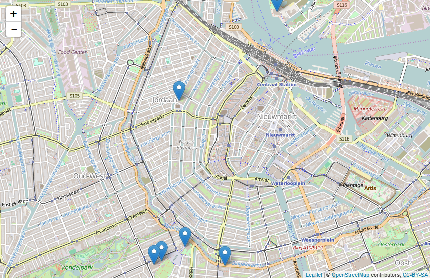

\thispagestyle{empty}

\newpage
\thispagestyle{empty}
\mbox{}
\newpage
\pdfbookmark{\contentsname}{toc}
\hypersetup{linkcolor=black}
\setcounter{secnumdepth}{4}
\setcounter{tocdepth}{4}
\tableofcontents
\hypersetup{linkcolor=blue}
\newpage
\thispagestyle{empty}
\mbox{}
\newpage

\twocolumn

# Voorwoord {-}
\markboth{Voorwoord}{}

Deze handleiding is speciaal samengesteld voor de Hands-on workshop **Geografische analyses met R** op de 4^e^ jaarlijkse OSGeo.nl Dag, op de GeoBuzz, op woensdag 25 november 2015 in Den Bosch.

Het was in de zomer van 2015, in Como (Noord-Italië), in de wandelgangen van de [FOSS4G-Europe 2015](http://europe.foss4g.org/2015/). Daar werd ik benaderd door Gert-Jan van der Weijden, de voorzitter van [de stichting OSGeo.nl](http://osgeo.nl/). Eerder die week had ik in Como de workshp **R for spatial data** van Robin Lovelace (University of Leeds) gevolgd. En nu kwam Gert-Jan met het verzoek of ik een soortgelijke workshop zou willen geven in Den Bosch. Daarop heb ik maar *ja* gezegd.

De afgelopen weken heb ik veel met **R** gespeeld. Een opdracht intypen op de commandoregel, en dan kijken wat er gebeurt. Want ja, om ergens een workshop over te kunnen geven, moet je er wel iets van weten. Dit document is het voorlopige resultaat van mijn speurtocht: laat ik maar meteen opschrijven wat ik geleerd heb, want anders vergeet ik het weer.

Dit is ook de plek om de Friese Woudloper, [Willy Bakker](https://twitter.com/friesewoudloper) te bedanken voor haar inbreng. Met haar technische adviezen heeft ze een grote bijdrage geleverd aan de totstandkoming van deze handleiding.

**R** heeft - als geografisch informatiesysteem - beslist voordelen ten opzichte van traditionele GIS desktop applicaties, met al die knopjes waarop je kunt klikken. Waar je in een gewoon GIS systeem de knoppenbalken en menu's op een gegeven moment wel zat bent ('*Kan dit niet sneller? kan ik dit niet automatiseren?*'), moet je in **R** al vanaf het allereerste commando goed nadenken over de syntaxis van je opdracht.

Ik hoop dan ook van harte dat mijn aantekeningen nuttig zijn voor anderen die kennis willen maken met de geografische kracht van **R**.

Overigens is dit een '*werk in uitvoering*'. Er zullen de komende tijd nog enkele nieuwe versies van deze cursushandleiding verschijnen. De meest recente versie staat altijdd [hier](http://www.twiav.nl/nl/cursusR/Geografische_analyses_met_R.pdf).


\href{mailto:e.j.h.polle@gmail.com?SUBJECT=Geografische analyses met R}{Egge-Jan Pollé}

Asperen - November 2015

\newpage

\newpage

\twocolumn

# Inleiding

## De paden op, de lanen in, vooruit met flinke pas...

In dit boek gaan we op reis. Op reis door de werled van **R**, ja, je kunt wel zeggen de *wondere* wereld van **R**.

Ter voorbereiding op dit avontuur volgen hieronder enkele op- en aanmerkingen, handige tips en nuttige trucs.


## Over dit boek

### Voor wie?

Voor wie is dit boek bedoeld? Gewoon: voor iedereen die meer wil weten over het uitvoeren van geografische analyses met **R**. Is er specifieke voorkennis vereist? Nee (en ja), of: Ja (en nee)! Nou, toch meer 'nee' dan 'ja'. Dit document is geschreven om je te helpen iets te leren. Dus hoe minder voorkennis je hebt, hoe meer je hiervan kan leren.

**R** is een statistische programmeertaal, en wij gaan specifiek kijken naar geografische functionaliteit. Dus dan komen er veel terreinen bijelkaar: statistiek, informatica, GIS, geodesie, kartografie, etc., etc.. Een beetje voorkennis in één of meerdere van deze disciplines is nuttig, maar niet strikt noodzakelijk. Het belangrijkste is eigenlijk: een gezonde dosis nieuwsgierigheid, en creativiteit en doorzettingsvermogen.

*Maar ik ben helemaal geen programmeur!* Dat is niet erg, want dat geldt voor de meeste van ons. **R** is leuk omdat je snel mooie kaartjes en grafieken op het scherm kan toveren, en dat je dat zelf moet programmeren, dat ga je op den duur ook leuk vinden.

In elk hoofdstuk vind je codevoorbeelden met uitgebreide toelichting. Je moet deze voorbeelden niet alleen lezen, maar vooral gewoon doen: ga achter **R** zitten en probeer het zelf uit. Met de data die bij de oefeningen wordt meegeleverd of, beter nog, met je eigen geografische bestanden.

Dit cursusmateriaal leent zich voor zelfstudie, maar kan ook gebruikt worden in een klassikale omgeving, als onderdeel van een opleiding of workshop.

### *Werk in uitvoering*

Deze bundel is een "work in progress". Dit is versie \versionnumber. De komende tijd zal de het aantal hoofdstukken nog worden uitgebreid. Het advies is dan ook om, voor je verder leest, [via deze link](http://www.twiav.nl/nl/cursusR/Geografische_analyses_met_R.pdf) te controleren of je [de meest recente versie](http://www.twiav.nl/nl/cursusR/Geografische_analyses_met_R.pdf) hebt.

En o ja, op- en aanmerkingen zijn meer dan welkom. Heb je

+ een alternatieve oplossing gevonden voor een probleem,
+ suggesties voor aanvullende oefeningen,
+ schrijf- en spelfouten ontdekt (???),
+ of is er een *package* waarvan je vindt dat er beslist een hoofdstuk aan moet worden gewijd,

neem dan contact op met de \href{mailto:e.j.h.polle@gmail.com?SUBJECT=Geografische analyses met R}{auteur}.

### Broncode openbaar 

Dit document is *open source*. De broncode is geschreven in een mengeling van [R Markdown](http://rmarkdown.rstudio.com/) en pure  [\LaTeX](https://www.latex-project.org/). Het PDF document is gecompileerd met **RStudio** (zie verderop in dit boek).

Het bronbestand (Geografische_analyses_met_R.Rmd) is te vinden in deze GitHub repository:

<https://github.com/TWIAV/Geografische_analyses_met_R>.

Dus als je wijzigingsvoorstellen direct wil doorvoeren in de bron: *Fork me on GitHub*.

## Benodigdheden

### Computer

Om deze cursus te volgen heb je een machine nodig. Ja, hè, hè. Maar wacht, dat hoeft niet per se je eigen computer te zijn, dat kan ook een virtuele machine zijn.

#### Virtuele machine van OSGeo-Live


Wij raden je aan om eens te kijken naar de *Virtual Machine* van [OSGeo-Live](http://live.osgeo.org/en/index.html). Dit is een machine waarop een grote verscheidenheid aan *open source* (en dus gratis) geografische applicaties geïnstalleerd staat. Het is, zeg maar, de reclame-DVD van [The Open Source Geospatial Foundation](http://www.osgeo.org/).

En ook het besturingssysteem van deze machine is *open source*, dat is namelijk [Lubuntu](http://lubuntu.net/), een Linux distributie. (Let op: de desktop omgeving van Lubuntu is redelijk gebruikersvriendelijk, dus ook een verstokte MS Windows gebruiker kan daarin de weg wel vinden.)

Je kunt de virtuele machine van **OSGeo-Live** gebruiken met behulp van [VirtualBox](https://www.virtualbox.org/), de virtualisatieoplossing van Oracle. Ook **VirtualBox** is gratis te downloaden.

Als deze optie aantrekkelijk klinkt, kijk dan hier voor [installatieinstructies](http://live.osgeo.org/en/quickstart/virtualization_quickstart.html). 

(**R** staat al geïnstalleerd op **OSGeo-Live**; **RStudio** moet je zelf even toevoegen.)

## Cursusbestanden

De gegevensbestanden die je tijdens deze cursus nodig hebt worden aangeboden op de website [www.twiav.nl](http://www.twiav.nl/nl/geodata.php) of via andere, openbare bronnen, zoals de site van het [Centraal Bureau voor de Statistiek](http://www.cbs.nl/nl-NL/menu/home/default.htm).

Overigens is het downloaden van de benodigde data onderdeel van het script dat je bij elke oefening gaat schrijven. Dus je hoeft de bestanden niet zelf op te halen, dat gaat **R** voor je doen. 

## Meer informatie over het gebruik van R

Dit boek is geschreven voor een breed publiek, ook voor gebruikers die nog weinig of geen ervaring hebben met **R**. Maar dit is geen beginnershandleiding. De focus ligt op de geografische functionaliteit van **R**. Dit betekent dat - in de volgende hoofdstukken - sommige regels code uitvoerig worden toegelicht, terwijl andere commando's zonder verder commentaar of uitleg worden doorgegeven.

Het kan daardoor gebeuren dat je een regel code intikt, zonder dat je alle functies en parameters volledig begrijpt. Maar dat is niet erg, want om **R** te leren moet je kilometers maken, veel achter het systeem zitten, zaken uitproberen en vervolgens uitzoeken waarom iets wel (of juist niet) werkt.

Het wordt ten sterkste aangeraden om de **R** scripts in deze cursus regel voor regel uit te voeren (en niet meteen in één keer in zijn geheel). Probeer vooraf te bedenken wat er volgens jou gaat gebeuren, en controleer na elke regel of dat ook inderdaad zo is. 

Door het hele boek heen vind je links naar externe bronnen voor aanvullende informatie (ja, de blauwe letters, ja). Hieronder wijzen we nog even op een aantal specifieke startpunten voor een zoektocht naar informatie over **R**.

### *The R Manuals*

Een goed begin is de pagina met handleidingen die door leden van het *R Development Core Team* zelf wordt bijgehouden: <https://cran.r-project.org/manuals.html>. Hier vind je bijvoorbeeld [An Introduction to R](https://cran.r-project.org/doc/manuals/r-release/R-intro.pdf).

### Discussiegroepen op internet

Tip: zoek - voordat je een vraag stelt in een discussiegroep - uit of deze niet al eens gesteld en beantwoord is. Die kans is namelijk groot. Als je met heel specifieke zoektermen googlet dan vind je het antwoord misschien wel in de archieven van één van de de onderstaande mailinglijsten: 

+ R Mailing Lists: er zijn verschillende discussiegroepen met betrekking tot **R** (zie overzicht: <https://www.r-project.org/mail.html>), waaronder een aantal **Special Interest Groups (SIG)**, zoals de [R-sig-Geo -- R Special Interest Group on using Geographical data and Mapping](https://stat.ethz.ch/mailman/listinfo/r-sig-geo).
+ [Stack Overflow](http://stackoverflow.com/): een vraag- en antwoordsite voor programmeurs, die elkaar helpen, met bijna 5 miljoen deelnemers wereldwijd. Ook veel vragen, en nuttige antwoorden, over **R**.

\newpage

\onecolumn

# Het Project R

## Inleiding

**R** is een softwarepakket en een ontwikkelomgeving voor statistische berekeningen en het weergeven van grafieken.  De titel van de homepage van de website van **R** (<https://www.r-project.org/>) luidt dan ook: **The R Project for Statistical Computing**.

**R** is een populaire toepassing voor onderzoekers en analisten op allerlei terreinen, en wordt vaak genoemd in relatie met termen als *Big Data* en *Data Science*.

In deze handleiding zullen we laten zien dat **R** ook heel goed overweg kan met geografische data, dat wil zeggen gegevens waar een geografisch object aan gekoppeld is.

### Een korte geschiedenis van R

De ontwikkeling van **R** begint in de vroege jaren negentig van de vorige eeuw. De ontwikkelaars van het eerste uur zijn Ross Ihaka en Robert Gentleman. Zij ontmoeten elkaar voor het eerst in 1990 op het *Department of Statistics* van de *University of Auckland* (Nieuw-Zeeland). Zij halen een deel van hun inspiratie uit **S**, een programmeertaal die ontwikkeld is in de laboratoria van Bell. Bij wijze van grap noemen Ihaka en Gentleman hun taal **R**. Dat is immers niet alleen de letter die in het alfabet precies voor de S komt, maar tevens de eerste letter van hun beider voornamen.

Al kort na het uitbrengen van een vroege versie in 1994 sporen collega's van over zee hen aan om de broncode van deze nieuwe programmeertaal vrij te geven. Aangezien ze inschatten dat de vooruitzichten van **R** als commerciëel product slechts beperkt zijn, brengen ze hun geesteskind inderdaad uit als 'vrije software', onder de GPL licentie van de *Free Software Foundation*. Vanaf dat moment kan **R** gratis gedownload worden. Ook wordt er een discussielijst opgezet, waarop gebruikers over de verdere ontwikkeling van **R** mee kunnen praten.

En daarmee wordt een spectaculaire groei in gang gezet. Al snel kunnen Ihaka en Gentleman het niet meer samen aan en wordt het ontwikkelteam uitgebreid met een select gezelschap van programmeurs die direct toeganghebben tot de broncode - met schrijfrechten. In dit kernteam van ongeveer 20 man zitten een aantal bekende onderzoekers op het gebied van statistiek.

Op 29 februari 2000 besluit men dat de programmeertaal voldoende functionaliteit heeft, en stabiel genoeg is, om over te gaan tot het vrijgeven van versie R-1.0.0 ([Ihaka, 2009](https://www.stat.auckland.ac.nz/~ihaka/downloads/Massey.pdf)).

##	R downloaden en installeren

Het eerste dat je moet doen om met **R** te kunnen werken is natuurlijk: het downloaden en installeren van de software.

**R** wordt niet op één centrale plaats aangeboden, maar is beschikbaar via een uitgebreid netwerk van zogeheten *mirror sites* onder de naam **CRAN**, het **Comprehensive R Archive Network**. Dit is een wereldwijd netwerk van servers - vaak van universiteiten - waarop identieke en actuele versies van de software staan opgeslagen.

Vanuit het **CRAN** wordt het vriendelijke verzoek gedaan om voor het downloaden een server in de buurt te gebruiken, om het netwerk niet te zwaar te belasten. Daarom hebben we gekozen voor de server van de Universiteit Utrecht:
<http://cran-mirror.cs.uu.nl/>.

Op de downloadpagina moet je eerst een keuze maken voor **R** voor het juiste besturingssysteem. Voor het schrijven van deze handleiding maken we gebruik van een 64-bit Windows 7 machine, dus wij kiezen **R for Windows**. Vanzelfsprekend is **R** ook beschikbaar voor (Mac) OS X en voor Linux (vaak al opgenomen in de distributie).

Op de volgende pagina selecteren we de **base distribution**, want, zoals de website zegt: *dit is wat jij wilt als je **R** voor de eerste keer installeert*.

Op het moment van schrijven is versie 3.2.2 van 14 augustus 2015 de meest recente release van **R**. Maar de ontwikkelingen gaan snel, dus wellicht is er al een nieuwere versie beschikbaar als je dit leest. Zorg ervoor dat je  de laatste versie downloadt.

Dubbelklik na het downloaden op het bestand **R-X.X.X-win.exe** om de installatie te starten. (Op dit moment is dat *R-3.2.2-win.exe*.) 

\tcbset{coltitle=black, colbacktitle=white, colframe=gray!75!black,colback=white,nobeforeafter}
\begin{tcolorbox}[enlarge by=5mm, hyphenationfix, title=Codenaam]
Elke nieuwe versie van \textbf{R} krijgt naast een nummer ook een codenaam. Zo heet versie 3.2.2  \textbf{Fire Safety}. Voorbeelden van enkele codenamen uit het verleden zijn:  \textbf{Spring Dance} (3.0.3),  \textbf{Security Blanket} (2.15.3),  \textbf{Trick or Treat} (2.15.2) en  \textbf{December Snowflakes} (2.14.1).\par
En ook de release die jij hebt geïnstalleerd  heeft een bijzonder codenaam. Deze verschijnt in de console als je \textbf{R} opstart.
\end{tcolorbox}

Tijdens het installatieproces kun je - afhankelijk van het besturingssysteem - kiezen of je de 32-bit of de 64-bit versie wilt installeren. Als je geen keuze maakt, dan worden beide versies geïnstalleerd.

\begin{figure}[!htb]
\centering
\includegraphics{images/Rondesktop.png}
\caption{R op het bureaublad}
\label{Rondesktop}
\end{figure}

Na het voltooien van de installatie kun je **R** opstarten. In de afbeelding hieronder zie je de **RGui** met daarin de **R Console**.

\begin{figure}[!htb]
\includegraphics{images/RGUI.png}
\caption{De grafische gebruikersinterface van R}
\label{RGUI}
\end{figure}


Voor nu kiezen we er voor om **R** direct te verlaten door *q()* te typen achter de prompt.

```{r eval=FALSE}
q()
```

## RStudio downloaden en installeren

In de vorige paragraaf hebben we **R** direct na het opstarten weer afgesloten. En niet zonder reden. Om goed met **R** te kunnen werken gaan we eerst nog **RStudio** installeren.

**RStudio** is een **IDE**, een *integrated development environment* ofwel een geïntegreerde ontwikkelomgeving, die het werken met **R** op een aantal punten veel gemakkelijker maakt. Het is niet strikt noodzakelijk om **RStudio** te installeren. Je kan ook met **R** werken zonder deze toevoeging, maar zoals gezegd: het leven van een **R** programmeur wordt zoveel makkelijker met **RStudio**. Daarom zullen wij in deze handleiding gebruik maken van deze omgeving.       

\begin{tcolorbox}[enlarge by=5mm, hyphenationfix, title=Productiviteit]
RStudio bied een grote hoeveelheid functionaliteiten om de productiviteit van een \textbf{R} programmeur te verhogen.\par
Twee belangrijke voorbeelden hiervan zijn:
\begin{itemize}
\item \textbf{Syntax Highlighting} (in het Nederlands \textit{syntaxiskleuring} of \textit{accentuering}): door het gebruik van verschillende kleuren tekst is de structuur van de code gemakkelijker te doorgronden, en zijn syntaxisfouten gemakkelijker op te sporen.
\item \textbf{Code Completion}: RStudio biedt automatische aanvulling bij het schrijven van code, zowel voor namen van objecten die eerder gedefinieerd zijn, als voor functies en functieargumenten.
\end{itemize}
Na kennismaking met RStudio wil je nooit meer terug naar de RGui zoals we die in de vorige paragraaf hebben gezien.
\end{tcolorbox}       

Let op: **RStudio** is geen vervanging, maar draait bovenop **R**. Dus je moet er voor zorgen dat **R** eerst is geïnstalleerd voordat je de studio toevoegt.

Ga naar de website <https://www.rstudio.com/> en klik op de button **Download RStudio**. We zijn op zoek naar de gratis desktop versie.

Op het moment van schrijven is versie 0.99.489 van 5 november 2015 de meest recente release van **RStudio**. Maar ook hier geldt dat er hoogstwaarschijnlijk al een nieuwere versie beschikbaar is als je dit leest.

Dubbelklik na het downloaden op het bestand **RStudio-X.XX.XXX.exe** om de installatie te starten. (Op dit moment is dat *RStudio-0.99.489.exe*.)

\begin{figure}[!htb]
\centering
\includegraphics{images/RStudioondesktop.png}
\caption{RStudio op het bureaublad}
\label{RStudioondesktop}
\end{figure}


\newpage

### De RStudio gebruikersinterface

Na het voltooien van de installatie kun je **RStudio** opstarten. De interface van RStudio bestaat uit verschillende schermen (zie Figuur \ref{RStudioGUI}).

+ **Linksonder:** hier zie je het *Console* venster. Dit is de commandoregel van **R**. Achter de prompt (**>**) kun je commando's ingeven die worden uitgevoerd door **R**, zodra je een \<ENTER\> hebt gegeven. En dit is ook de plek waar **R** waarschuwingen en/of foutmeldingen zal afdrukken.

+ **Linksboven:** zodra je een nieuw **R** Script aanmaakt, of een bestaand script opent, dan wordt dat bestand hier in de linkerbovenhoek getoond. En ook het venster van de *Data Viewer* wordt hier getoond.

+ **Rechtsboven:** op het tabblad **Environment** welke objecten en welke waarden **R** in het geheugen heeft. Ook kun je hier zien welke packages geladen zijn. Op het tabblad **History** kun je naar eerder ingevoerde commando's zoeken, en deze eventueel hergebruiken.

+ **Rechtsonder:** hier in der rechteronderhoek vind je vijf verschillende tabbladen:
    + **Files:** hier kun je door het bestandssysteem bladeren
    + **Plots:** in dit venster worden je plots, dat wil zeggen: de grafieken en de kaartjes, getoond. (En RStudio houdt een geschiedenis bij van eerder gemaakte plots.)
    + **Packages:** hier kun je packages ('bibliotheken') installeren en of laden.
    + **Help:** Altijd nuttig :-)
    + **Viewer:** op dit tabblad wordt lokale webinhoud getoond (bijvoorbeeld als je - later in dit boek - met de bibliotheek `leaflet` aan de slag gaat).


\begin{figure}[!htb]
\includegraphics{images/RStudio.png}
\caption{De grafische gebruikersinterface van RStudio}
\label{RStudioGUI}
\end{figure}

\newpage

## Packages, packages, packages... (ook wel: bibliotheken)

**R** is modulair opgebouwd. Er is het basissysteem, zoals we dat in de vorige paragrafen hebben geïnstalleerd. Maar daar bovenop zijn er vele aanvullende bibliotheken, zogeheten *packages*, beschikbaar.

Door middel van een *package* wordt extra functionaliteit toegevoegd aan **R**. Er zijn in de loop der jaren veel van dergelijke bibliotheken aan het **Comprehensive R Archive Network** toegevoegd, met bijdragen van wetenschappers en programmeurs van over de hele wereld. Ook vanuit Nederland. 

Tijdens een presentatie in oktober 2009 kon Ross Ihaka nog 'opscheppen' dat er al meer dan 1.700 *packages* aan het **CRAN** waren toegevoegd ([Ihaka, 2009](https://www.stat.auckland.ac.nz/~ihaka/downloads/Massey.pdf)), maar nu - november 2015, dus zes jaar later - staat de teller al op het aantal van 7.488 bijdragen (Zie: <https://cran.r-project.org/web/packages/>).     

Ook voor het uitvoeren van geografische analyses met  **R** zijn vele bibliotheken beschikbaar. Voor een overzicht, zie: [CRAN Task View: Analysis of Spatial Data](https://cran.r-project.org/web/views/Spatial.html).

In de volgende hoofdstukken zullen we telkens één of meer van deze bibliotheken introduceren. De rode draad in de rest van het boek is dan ook: *Packages, packages, packages...* (Overigens heeft deze handleiding niet de pretentie om alle 'geografische' bibliotheken te behandelen. Er is altijd meer dan men in één boek kan samenvatten.)

Als je op zoek bent naar bepaalde functionaliteit die niet beschikbaar is in basis-**R**, dan is de kans groot dat een aanvullende bibliotheek uitkomst biedt. En anders wordt je van harte uitgenodigd om zelf een *package* te schrijven en met de gemeenschap te delen.

### Een bibliotheek installeren: `install.packages()`

Om een bibliotheek te kunnen gebruiken, moet je hem eerst - éénmalig - installeren. Dit kan heel eenvoudig vanuit **RStudio** zelf. Bijvoorbeeld:

```{r eval=FALSE}
install.packages("rgdal") # bibliotheeknaame met aanhalingstekens
```

Zoals je ziet wordt de benodigde software automatisch gedownload en geïnstalleerd.

### Een bibliotheek laden: `library()`

Om een funcite uit een bepaalde bibliotheek te kunnen gebruiken, moet je deze bibliotheek eerst laden. En dit moet elke keer dat je **R** gebruikt opnieuw gebeuren. Bijvoorbeeld:

```{r eval=FALSE}
library(tmap) # bibliotheeknaame zonder aanhalingstekens
```

Als je een (fout)melding krijgt dat een bepaalde functie onbekend is, dan kan dat komen doordat je de benodigde bibliotheek niet geladen hebt.

In **R** scripts zie je vaak bovenaan één of meerdere `library()` statements staan, zodat de benodigde bibliotheken geladen worden voordat de rest van het script wordt uitgevoerd.

\newpage

# Aan de slag

## Kennismaking met de ontwikkelomgeving

Voordat we in de volgende hoofdstukken met geografische data gaan werken volgt hier een eerste kennismaking met de IDE, *Integrated development environment* die RStudio is.

### De werkmap (*Working Directory*): `getwd()` en `setwd()`

De *Working Directory* is de map waar **R** invoerbestanden zoekt en uitvoerbestanden wegschrijft.

Dus als je de opdracht geeft om een CSV bestand in te lezen met het commando `read.csv("test.csv")`, dan verwacht **R** dat het bestand in de werkmap staat. Met `getwd()` kun je opvragen wat de werkmap is:

```{r eval=FALSE}
getwd()
```

Dit is nu waarschijnlijk de standaard documentenmap.

Het wordt aangeraden om (per project) een speciale werkmap in te stellen. Dit doe je met `setwd()`. Bijvoorbeeld:

```{r eval=FALSE}
setwd("C:/CursusR") # Let op: gebruiek / of \\ (in plaats van \)
```

Tip: blader op de **Files** tab (in de rechteronderhoek van **RStudio**) naar de door jou ingestelde werkmap, zodat je in de gaten kunt houden welke bestanden **R** daar allemaal neerzet.

### Oefening: een CSV bestand aanmaken met `write.table`

Voer het onderstaande script uit (regel voor regel!) en bekijk de inhoud van het uitvoerbestand `maanden.csv` dat in de werkmap staat. 

```{r}
nummer <- c(1:12)
en_lang <- month.name
en_kort <- month.abb
# months in your current locale
nl_lang <- format(ISOdate(2000, 1:12, 1), "%B")
nl_kort <- format(ISOdate(2000, 1:12, 1), "%b")
maanden <- data.frame(nummer, en_lang, nl_lang, en_kort, nl_kort)
write.table(maanden, file="maanden.csv", sep=",", row.names=FALSE)
```

\newpage

## Oefening: bestanden downloaden en uitpakken met **R** \label{dwnld}

Voor veel oefeningen in dit boek worden datasets gebruikt die als zip bestand op de website [www.twiav.nl](http://www.twiav.nl/nl/geodata.php) staan. Het is niet nodig om deze bestanden zelf handmatig te downloaden en uit te pakken. Met een paar regels code in het **R** script kun je dit automatisch laten doen.

Hieronder staat een voorbeeld van de 'downloadprocedure' die in veel scripts in deze cursus wordt gebruikt.

Doorloop deze procedure één of meerdere keren (en lees de commentaarregels, die beinnen met een *#*), en kijk na elke stap wat er gebeurd is. Gebruik `?` voor uitleg over een functie. Bijvoorbeeld: `?unzip`, `?unlink` of `?rm`.

```{r}
# Sla de URL van het te downloaden bestand op in een variabele
URL <- "http://www.twiav.nl/files/NL_Gemeenten2014.zip"
 # Extraheer de bestandsnaam uit de URL
bestand <- file.path(basename(URL))
 # Maak een submap in de werkmap (voor het opslaan van de invoerdata)
dir.create("./Data", showWarnings = FALSE)
 # Sla het huidige pad van de werkmap op in een variabele
werkmap <- getwd()
# Switch tijdelijk naar de Datamap
setwd("./Data")
# Download het bestand
download.file(URL, destfile = bestand, mode = "wb")
# Pak het bestand uit
unzip(bestand)
# Ruim een beetje op:
 # Na het uitpakken kan het zip bestand verwijderd worden
unlink(bestand)
# De variabelen 'URL' en 'bestand' zijn niet meer nodig na de download
rm(URL, bestand)
# Keer terug naar de oorspronkelijke werkmap
setwd(werkmap)
# De variabele 'werkmap' is niet meer nodig na terugkeer naar de oorspronkelijke werkmap
rm(werkmap)
```

Hoeveel bestanden staan er na deze actie in de map 'Data'?


\newpage

# Het werken met geografische gegevens in R \label{chsp}

## De bibliotheek `sp`

Het package `sp` is een belangrijk element voor het gebruik van geografische data in **R**. Deze bibliotheek biedt een aantal klassen en methoden voor het verwerken van deze gegegevens. Zo zijn er ruimtelijke datastructuren gedefinieerd voor het opslaan van punt-, lijn- en vlakobjecten, en voor rasterdata, al dan niet met daaraan gekoppelde attribuutgegevens.

De bouwstenen - dat wil zeggen de klassen en methoden - die deze bibliotheek aanlevert, worden door vele andere geografische **R** packages gebruikt, zowel direct als indirect. En dat was precies de bedoeling van de auteurs, Edzer Pebesma en Roger Bivand, toen zij rond 2003 met de ontwikkeling van deze package begonnen.

**R** is oorspronkelijk ontwikkeld als programmeertaal voor èn door statistici, maar omdat (bijna) elk gegeven ook een ruimtelijke component heeft (*"Waar?"*), was er al snel ook belangstelling voor deze taal vanuit geografische hoek. En door de modulaire opbouw van **R** was het mogelijk om GIS functionaliteit toe te voegen door middel van een zelf te bouwen package. Maar de ontwikkeling van deze geografische bibliotheken werd belemmerd doordat er geen gemeenschappelijk ruimtelijk raamwerk was; elke package had zijn eigen regels voor het opslaan en verwerken van geodata. Om aan deze wildgroei een einde te maken hebben Pebesma en Bivand de hadschoen opgepakt, en een aantal zaken éénduidig vastgelegd in hun bibliotheek. Hiermee hebben ze het mogelijk gemaakt dat de analyse van geografische gegevens met **R** op een veel meer coherente wijze kan worden uitgevoerd ([Pebesma en Bivand, 2005](https://cran.r-project.org/web/packages/sp/vignettes/intro_sp.pdf)).

\begin{tcolorbox}[enlarge by=5mm, hyphenationfix, title=De bocht in de Maas]
    \begin{minipage}[t]{0.25\linewidth}
    \vspace*{0pt}
        \includegraphics[height=6.03cm,width=2.61cm]{images/Meuse.png}
    \end{minipage}
    \begin{minipage}[t]{0.75\linewidth}
    \vspace*{0pt}
        Met \textbf{R} worden een aantaal oefendatasets meegeleverd, handig voor onderwijs- en demonstratiedoeleinden. Zo zul je vaak \textbf{R} oefeningen tegenkomen, waarin bijvoorbeeld de {\small\ttfamily{mtcars}} of de {\small\ttfamily{iris}} dataset wordt gebruikt.\par
        En ook bij het {\small\ttfamily{sp}} package zit een dergelijk oefenbestand: de \textit{Meuse river data set}. Deze set bevat gegevens over de locatie van concentraties van zware metalen (cadmium, koper, lood en zink) in de bodem van een overstromingsvlakte in een bocht van de Maas, ten westen van het Limburgse plaatsje Stein.  Deze gegevens zijn in 1993 verzameld door Ruud van Rijn and Mathieu Rikken, in het kader van hun afstudeerproject Fysische Geografie aan de Universiteit Utrecht.\par
        Deze data zijn door Edzer Pebesma - ook Fysisch Geograaf, in 1996 gepromoveerd aan dezelfde universiteit in Utrecht - toegevoegd aan 'zijn'  {\small\ttfamily{sp}} bibliotheek.\par
        Tegenwoordig is Pebesma hoogleraar aan de \textbf{Westfälische Wilhelms-Universität (WWU)} in Münster (Duitsland), waar hij directeur is van het \textbf{Institut für Geoinformatik}.
    \end{minipage}\hfill%
    Zie voor voorbeelden waarin deze Maasdata worden gebruikt:\par
    \url{http://rspatial.r-forge.r-project.org/gallery/}
\end{tcolorbox}

Zie voor meer informatie over de bibliotheek `sp` de handleiding op het CRAN:

<https://cran.r-project.org/web/packages/sp/sp.pdf>.

\newpage

## Het aanmaken van een `SpatialPointsDataFrame` - 1 \label{spdf}

In deze paragraaf gaan we kennismaken met één van de hiervoor genoemde ruimtelijke datastructuren. We gaan zelf een SpatialPointsDataFrame aanmaken, op basis van gegevens in een data.frame.

Begin met het installeren van de betreffende bibliotheek en laad deze in het geheugen:

```{r eval=FALSE}
install.packages("sp") #éénmalig
library(sp)
```

```{r echo=FALSE}
library(sp)
```

Het [invoerbestand](http://www.twiav.nl/files/NL_Museums_Amsterdam.csv) is een lijstje met enkele bezienswaardigheden in Amsterdam, met bijbehorende x- en y-coördinaten. Dit [bestand](http://www.twiav.nl/files/NL_Museums_Amsterdam.csv) is online beschikbaar en staat op [deze lokatie](http://www.twiav.nl/files/NL_Museums_Amsterdam.csv). 

Je hoeft dit bestand niet te downloaden en op te slaan. Je kan het direct inlezen vanaf de huidige lokatie.

```{r}
URL <- "http://www.twiav.nl/files/NL_Museums_Amsterdam.csv"
ams.df <- read.csv(URL)
ams.df
```
Bekijk van welke klasse ams.df is:

```{r}
class(ams.df)
```
De kolommen 3 en 4 bevatten de coordinaatinformatie (x en y). Deze kun je op de volgende wijze selecteren:

```{r}
ams.df[3:4]
```

En de eerste twee Kolommen bevatten attribuutgegevens. Deze kun je desgewenst ook even bekijken: `ams.df[1:2]`

Met deze informatie kunnen we nu een geografisch object maken:

```{r}
ams.spdf <- SpatialPointsDataFrame(coords = ams.df[3:4], data = ams.df[1:2])
ams.spdf
```

Bekijk van welke klasse ams.spdf is:

```{r}
class(ams.spdf)
```

En vraag de samenvatting op:
```{r}
summary(ams.spdf)
```

**Dat ziet er goed uit.**

\newpage

### Plot

In de vorige paragraaf hebben we een SpatialPointsDataFrame aangemaakt, en nu gaan we dit plotten, om te zien hoe dat er uit ziet.

De snelste manier is:

```{r eval=FALSE}
plot(ams.spdf)
```

Dit geeft wel een erg saai kaartbeeld. Dat moet beter kunnen. Na wat experimenteren en uitzoeken zou je tot het volgende commando kunnen komen:

```{r eval=FALSE}
plot(ams.spdf, pch = 19, col = "blue", axes = TRUE,
     main = "Enkele bezienswaardigheden in Amsterdam")
```

Je wordt hier uitgenodigd om gebruik te gaan maken van het uitgebreide helpsysteem dat bij **R** hoort, om uit te zoeken wat de verschillende parameters precies doen.

Je kunt tekstlabels toevoegen aan de musea met onderstaande opdracht:

```{r eval=FALSE}
text(coordinates(ams.spdf), as.character(ams.spdf$Name),
     cex = .7, pos = 4, col = "blue")
```

Doordat alle tekstlabels rechts van het museum staan ontstaat op het Museumplein enige overlap.

Dit kunnen we oplossen door niet één generieke positie (`pos = 4`) voor alle labels op te geven, maar door een vector aan te maken waarin ieder museum een eigen labelpositie krijgt, zodat we kunnen variëren.

Maak een vector aan met (initieel) voor elk museum de waarde 4. En bekijk de inhoud van deze vector:

```{r}
pos.vector <- rep(4, length(ams.spdf))
pos.vector
```

Ken nu een andere waarde toe voor het Stedelijk:

```{r}
pos.vector[ams.spdf$Name == "Stedelijk Museum"] <- 2
pos.vector
```

Plot opnieuw - nu met labels op goede plaats:

```{r amsplot, fig.cap='een voorbeeld van een plot', fig.align='default', fig.show='asis'}
plot(ams.spdf, pch = 19, col = "blue", axes = TRUE,
     main = "Enkele bezienswaardigheden in Amsterdam")
text(coordinates(ams.spdf), as.character(ams.spdf$Name),
     cex = .6, pos = pos.vector, col = "blue")
```

## Het toekennen van een CRS (*Coordinate Reference System*)

Het SpatialPointsDataFrame dat we in de vorige paragraaf (\ref{spdf}) hebben aangemaakt, is nog niet helemaal compleet, omdat we er nog geen coördinaatreferentiesysteem (CRS) aan hebben toegekend. Het Frame heeft weliswaar coördinaten, maar we hebben nog niet vastgelegd hoe deze aan een plek op aarde te relateren zijn.

Er zijn twee soorten coördinaatsystemen:

+ **ongeprojecteerd/geografisch**: in een dergelijk systeem wordt dor middel van lengte- en breedtegraden een positie op de aarde weergegeven,
+ **geprojecteerd**: in een projectie wordt een gedeelte van het aardoppervlak weergegeven in een 2-dimensionaal vlak.

Een bekend, en tegenwoordig alom gebruikt systeem van het eerste soort is WGS84. Het officiële Nederlandse systeem - het Rijksdriehoeksstelsel (zie paragraaf \ref{RDM}) - is een voorbeeld van het tweede type.

Het toekennen van een CRS gaat door middel van een `proj4string`, een lange ingewikkelde string met geodetische parameters. In de samenvatting die we eerder hebben opgevraagd - met `summary(ams.spdf)` - zagen we al dat er aan onze data nog geen CRS was toegekend: `proj4string : [NA]`.

Gelukkig hebben veel projecties tegenwoorig een zogeheten *EPSG* code, waardoor het makkelijker wordt om een `proj4string` toe te kennen.

\begin{tcolorbox}[enlarge by=5mm, hyphenationfix, title=EPSG?]
Het was de \textbf{European Petroleum Survey Group} die het initiatief heeft genomen de vele wereldwijd gebruikte coördinaatsystemen elk van een eigen, unieke code te voorzien, om de communicatie over locaties te vergemakkelijken. Het moge duidelijk zijn dat de (financiële) belangen van de olieindustrie hier groot zijn; men kan het zich simpelweg niet permitteren om op een verkeerde plek te gaan boren.\par
Hoewel de EPSG als organisatie al niet meer bestaat, wordt de EPSG Dataset nog steeds onderhouden door de  International Association of Oil \& Gas Producers (IOGP), tot voordeel van ons allen. Zie \url{http://www.epsg.org/}
\end{tcolorbox} 

Nu is natuurlijk de vraag: welk coördinaatsysteem gaan we aan onze data koppelen? Op die vraag is maar één antwoord mogelijk, namelijk: het juiste CRS. Je kunt immers niet zomaar een willekeurige referentie aan de gegevens hangen.

Dit betekent dat er altijd duidelijk moet zijn welk CRS bij geografische data hoort. Dit kan in de metadata staan, of het moet worden aangegeven door de dataleverancier.

De `x` en `y` van onze Amsterdamse museumdataset zijn gegeven in Nederlandse RD-coördinaten. De *EPSG* code van dit systeem is 28992.

Nu we dit weten kunnen we het CRS toekennen:

```{r}
proj4string(ams.spdf) <- CRS("+init=epsg:28992")
summary(ams.spdf)
```

\twocolumn

### Het Nederlandse coördinaatsysteem: het stelsel van de Rijksdriehoeksmeting \label{RDM}

In Nederland worden de meeste geografische data uitgewisseld in RD-coördinaten. De EPSG code voor het RD-stelsel is 28992.

Het Rijksdriehoeksstelsel is het nationale geodetische triangulatiesysteem van Nederland. De basis van dit systeem is een stereografische kaartprojectie gecentreerd op de spits van de Onze Lieve Vrouwetoren in Amersfoort. Op het zo verkregen projectievlak is een cartesiaans assenstelsel geconstrueerd. De voor het RD-stelsel gebruikte stereografische projectie is gebaseerd op de ellipsoïde van Bessel (1841). Een belangrijk voordeel van de projectie is, dat deze *conform* (hoekgetrouw) is: een hoek gemeten in de kaart is gelijk aan de werkelijke hoek. Voor een klein gebied als Nederland kan men gebruik maken van een dergelijke projectie, al nemen de afstandsfouten wel toe, naarmate men verder van de oorsprong verwijderd raakt.

De oorsprong van het systeem ligt in Amersfoort. Aanvankelijk was deze oorsprong ook het nulpunt (X=Y=0) van het systeem. Dit betekende dat men in het noordoosten van Nederland met positieve X- en Y-coördinaten kon werken, maar dat men in de andere delen van het land rekening moest houden met een negatieve X- en/of een negatieve Y-coördinaat. Om dit probleem op te lossen heeft men in het begin van de jaren zeventig van de twintigste eeuw het nulpunt verschoven, en wel 155 kilometer naar het westen en 463 kilometer naar het zuiden. Nederland ligt nu in zijn geheel in het eerste kwadrant van het assenstelsel, en door de extreem grote Y-verschuiving is de grootst voorkomende X-waarde nog altijd kleiner dan de kleinst mogelijke Y-waarde. Daardoor zijn alle voorkomende coördinaten nu positief, en de X- en Y-waarden zijn goed uit elkaar te houden (zie figuur \ref{afbRD}).

Het geldigheidsgebied voor de RD-coördinaten is nauwkeurig gedefinieerd. Globaal mogen deze coördinaten alleen gebruikt worden op het Nederlandse vasteland en in een kleine band daaromheen. Daar valt niet het gehele Nederlandse Continentaal Plat (het Nederlandse deel van de Noordzee) binnen. In België en Duitsland maakt men gebruik van andere coördinaatsystemen.

Voor meer achtergrondinformatie over de geodetische referentiestelsels van Nederland, zie: [De Bruijne et al. (2005)](http://www.ncgeo.nl/phocadownload/43Referentie.pdf).

\begin{tcolorbox}[enlarge by=5mm, hyphenationfix, title=De belangrijkste kenmerken van het RD-stelsel zijn:]
\begin{itemize}
\item stereografische projectie
\item conform (hoekgetrouw)
\item alleen bruikbaar voor het Nederlandse Grondgebied
\item alle coördinaatgetallen zijn positief
\item Y-coördinaat is altijd groter dan X-coördinaat
\item meeteenheid: meters
\item EPSG:28992
\end{itemize}
\end{tcolorbox}       


\onecolumn

\begin{figure}[!htb]
\includegraphics{images/RD.png}
\caption{De coördinaten van het Rijksdriehoeksstelsel}
\label{afbRD}
\end{figure}

\newpage

## Het aanmaken van een `SpatialPointsDataFrame` -2

### direct met `CRS`

**Let op:** het toekennen van het CRS hoeft niet in een aparte stap te gebeuren.Je kunt dit ook direct doen bij het aanmaken van het SpatialPointsDataFrame:

```{r}
ams.spdf <- SpatialPointsDataFrame(coords = ams.df[3:4],
                          data = ams.df[1:2], proj4string = CRS("+init=epsg:28992"))
```

### alternatieve syntaxis

In de voorgaande paragrafen hebben op de volgende manier een SpatialPointsDataFrame gecreëerd:

```{r}
URL <- "http://www.twiav.nl/files/NL_Museums_Amsterdam.csv"
ams.df <- read.csv(URL)
ams.spdf <- SpatialPointsDataFrame(coords = ams.df[3:4],
                          data = ams.df[1:2], proj4string = CRS("+init=epsg:28992"))
```

In deze paragraaf gaan we het op een iets andere manier doen.

1. Het is niet noodzakelijk om twee verschillende objecten - in het voorbeeld `ams.df` en `ams.spdf` - te gebruiken. Je kunt ook een object zelf omzetten van data.frame naar SpatialPointsDataFrame,
2. We gaan een alternatieve syntaxis gebruiken voor het aanwijzen van de coördinaten.


```{r}
URL <- "http://www.twiav.nl/files/NL_Museums_Amsterdam.csv"
mus <- read.csv(URL)
class(mus)
coordinates(mus) <- ~x+y
class(mus)
proj4string(mus) <- CRS("+init=epsg:28992")
```

Het object `mus` is identiek aan het object `ams.spdf`. Dit kun je controleren door de samenvatting op te vragen: `summary(mus)`.

Welke code beter is? Ach, dat is vaak een persoonlijke keuze van de programmeur, een kwestie van smaak. En, zoals de oude Romeinen pleegden te zeggen: *De gustibus non est disputandum*.

\newpage

## Een dataset herprojecteren met `spTransform()`

Het zal regelmatig voorkomen dat je een dataset met een bepaald CRS hetbt, terwijl voor de actie die je wilt uitvoeren een ander CRS noodzakelijk is. Gelukkig is het vrij eenvoudig om data te transformeren van het ene naar het andere CRS, op voorwaarde natuurlijk dat je de definitie van het doel-CRS kent.

Bijvoorbeeld: wij willen later in deze handleiding onze Amsterdamse musea op een OpenStreetMap kaart tonen (zie hoofdstuk \ref{chLflt}). Hiervoor is het noodzakelijk dat de coördinaten worden getransformeerd naar WGS84. Gelukkig kennen wij de *EPSG* code van dit CRS, namelijk EPSG:4326.

In het voorbeeld hieronder maken we een nieuw object aan, waarbij de coördinaten uit `ams.spdf` worden overgezet naar WGS84. Bekijk de `coordinates` van `ams.spdf.wgs84`: dit zijn nu geen meters meer, maar decimale graden.

```{r}
ams.spdf.wgs84 = spTransform(ams.spdf, CRS("+init=epsg:4326"))
summary(ams.spdf.wgs84)
```

## Handmatig een data.frame aanmaken

In de oefeningen hiervoor hebben we een data.frame verkregen door het inlezen van een bestand met `read.csv()`. In deze paragraaf maak je handmatig een data.frame aan met de functie `data.frame`.

```{r}
toren <- "Onze lieve Vrouwetoren"
X <- 155000
Y <- 463000
torens <- data.frame(toren, X, Y)
class(torens)
coordinates(torens) <- ~X+Y
proj4string(torens) <- CRS("+init=epsg:28992")
summary(torens)
plot(torens, pch = 19, col = "red", axes = TRUE, main = "De oorsprong van het RD-stelsel")
text(coordinates(torens), as.character(torens$toren), cex = .7, pos = 4, col = "red")
```


\newpage

# Het inlezen van geografische gegevens in R

## De bibliotheek `rgdal`

In dit hoofdstuk gaan we gegevens vanuit externe GIS bestanden inlezen in **R**. Dit doen we met de functie `readOGR` uit het *package* `rgdal`.

De bibliotheek `rgdal` biedt toegang vanuit **R** tot de functionaliteit van **GDAL**. Voordat we deze installatie gaan uitvoeren, geven we eerst wat informatie over de kracht van **GDAL**.

### GDAL

**GDAL** staat voor *Geospatial Data Abstraction Library*. Deze bibliotheek biedt abstracte gegevensmodellen voor geografische gegevens, één voor het raster- en één voor het vectorformaat. Daarnaast bevat **GDAL** een hoeveelheid programma's, zoals bijvoorbeeld `ogr2ogr`, `ogrinfo`, `gdaldem` en `gdal_contour`, voor het bewerken van geografische data. Deze programma's zijn zogeheten *command line utilities* (dat wil zeggen: ze moeten via de commandoregel worden aangesproken) en bieden vele opties voor onder andere:

* het inlezen en wegschrijven van geografische bestanden;
* het converteren van bestanden van het ene naar het andere geografische formaat (bijvoorbeeld van ESRI SHP naar GeoJSON);
* het herprojecteren van geografische bestanden (bijvoorbeeld van het Nederlandse RD-stelsel, EPSG:28992, naar WGS84, EPSG:4326);
* het analyseren en visualiseren van digitale hoogtemodellen en het genereren van contourlijnen;
* etc., etc.

**GDAL** wordt zowel gebruikt door Geo-ICT professionals, voor het - via de commandoregel - bewerken van geografische bestanden, als door programmeurs die op deze wijze geografische functionaliteit aan hun applicaties toe kunnen voegen.

De bibliotheek is oorspronkelijk ontwikkeld door Frank Warmerdam, maar tegenwoordig is de ontwikkeling en het onderhoud van **GDAL** ondergebracht bij de **Open Source Geospatial Foundation** (<http://www.osgeo.org/>).

Meer informatie over **GDAL** is te vinden op de website <http://www.gdal.org/>.

### `install.packages("rgdal")`

`rgdal` maakt geen onderdeel uit van de basisinstallatie van **R**, dus we zullen dit *package* zelf moeten toevoegen. 
Typ achter de prompt het volgende commando:

```{r eval=FALSE}
install.packages("rgdal")
```

Je ziet nu in de console dat de gevraagde bibliotheek automatisch wordt gedownload en geïnstalleerd. Overigens maakt `rgdal` gebruik van ruimtelijke klassen die in de *package* `sp` zijn gedefiniëerd. Deze afhankelijkheid wordt automatisch gedetecteerd. Dus mocht je `sp` nog niet hebben geïnstalleerd, dan verschijnt in de console de melding: `also installing the dependency 'sp'`.

\newpage

## De gebruikte bestandsformaten: MapInfo TAB en ESRI SHP

We gaan in dit hoofdstuk aan de slag met de volgende populaire bestandsformaten: de MapInfo tabel (*table*) en de ESRI Shapefile, twee bekende GIS formaten voor het opslaan van vectorgegevens (punten, lijnen, vlakken) met bijbehorende attribuutgegevens.

Zowel het Mapinfo TAB als het ESRI SHP formaat bestaan al redelijk lang: ze zijn ontwikkeld in de pioniersjaren van de geografische informatietechnologie, de jaren negentig van de vorige eeuw. Toen was het opslaan van geometrie nog een kunst. Tegenwoordig kan elk zichzelf respecterend databasesysteem geometrie bevatten.

Ook in een ander opzicht zijn er overeenkomsten: we spreken wel over een ESRI Shapefile, maar feitelijk bestaat deze uit een aantal deelbestanden (minimaal een \*.SHP, \*.DBF en een \*.SHX bestand, maar vaak nog meer). En een MapInfo TAB bestand bestaat minimaal uit een \*.TAB, \*.DAT, \*.MAP en een \*.ID bestand. In beide gevallen geldt dat alle deelbestanden dezelfde naam moeten hebben en in dezelfde map moeten staan.

Beide bestandstypen kunnen op precies dezlfde manier worden ingelezen met `readOGR()` in een spatial data frame.

Stel dat de tabel NL_Gemeenten2014.TAB in de submap `Data` in onze werkmap staat, en dat we deze in willen lezen in een object met de naam `gem2014`, dan is de syntax als volgt:

```{r eval=FALSE}
gem2014 <- readOGR(dsn = "Data", layer = "NL_Gemeenten2014")
```
De twee verplichte argumenten zijn:

+ `dsn` (data source name): dit is de map (in het Engels *folder* of *directory*) waarin het bestand - met de bijbehorende deelbestanden - staat. Voor deze map kun je zowel een relatieve als een absolute padverwijzing gebruiken,
+ `layer`: de naam van het bestand, zonder de extensie.

En voor een ESRI Shapefile is het precies hetzelfde...

Let op: het argument `dsn` is verplicht. Als het in te lezen bestand direct in de *working directory* staat (en dus niet in een submap), gebruik dan de volgende syntaxis: `dsn="."`

## Het inlezen van geografische data: `readOGR()` \label{readogr}

In deze oefening gebruiken we het bestand **NL_Gemeenten2014.TAB**. Achtergrondinformatie (metadata) over dit bestand staat in dit document: <http://www.twiav.nl/files/NL_Gemeenten2014_Leesmij.pdf>.

### Stap 1: het klaarzetten van de invoerbestanden

Om het bestand te downloaden, uit te pakken en klaar te zetten in de submap 'Data' van onze werkmap gebruiken we de regels code hieronder. (Deze 'downloadprocedure' wordt toegelicht in paragraaf \ref{dwnld}.)

```{r}
URL <- "http://www.twiav.nl/files/NL_Gemeenten2014.zip"
bestand <- file.path(basename(URL))
dir.create("./Data", showWarnings = FALSE)
werkmap <- getwd()
setwd("./Data")
download.file(URL, destfile = bestand, mode = "wb")
unzip(bestand)
unlink(bestand)
rm(URL, bestand)
setwd(werkmap)
rm(werkmap)
```

Controleer nu of de Mapinfo tabel (bestaande uit meerdere deelbestanden) op de juiste plek staat.

### Stap 2: het inlezen

De functie `readOGR` is onderdeel van de *package* `rgdal`, dus om de functie te kunnen gebruiken moet deze bibliotheek geladen zijn:

```{r}
library(rgdal)
```

En dan is het inlezen zelf een fluitje van een cent:

```{r}
gem2014 <- readOGR(dsn = "Data", layer = "NL_Gemeenten2014")
```

In de **Environment** tab (in de rechterbovenhoek van **RStudio**) zie je nu het object `gem2014` verschijnen, als **Large SpatialPolygonsDataFrame (403 elements, 2 Mb)**

OK - de gegevens zijn geladen. In dit hoofdstuk gaan we nog even verder met het laden van andere datasets. Verderop in dit boek gaan we de attribuutgegevens van de dataset `gem2014` inhoudelijk verkennen (zie hoofdstuk \ref{EDA}).

Toon de geometrie in de **Plots** tab:
```{r}
plot(gem2014, col = "darkgreen", border = "lightgray")
```

Vraag de klasse op:
```{r}
class(gem2014)
```
Kijk ook naar de samenvatting (niet afgedrukt in dit boek, omdat deze bijna twee pagina's zou beslaan):
```{r eval=FALSE}
summary(gem2014)
```
We zien hier dat er al een CRS aan de dataset is toegekend. Ja, nogal wiedes, deze coördinaatreferentiegegevens zijn overgenomen van het invoerbestand.

Als je de `proj4string` opvraagt, dan zie je dat de dataset geprojecteerd is in RD-coördinaten (en waarom de string in dit boek van de pagina loopt, dat weet ik nog niet...):

```{r}
proj4string(gem2014)
```

## Meer gegevens inlezen: nog twee MapInfo tabellen

In deze paragraaf lezen we de  tabellen **NL_Spoorwegen2015.TAB** en **NL_Stations2015.TAB** in, omdat we deze gaan gebruiken in allerlei oefeningen in de komende hoofdstukken. Achtergrondinformatie (metadata) over deze bestanden staat in dit document: <http://www.twiav.nl/files/SpoorwegenEnStations_Leesmij.pdf>.

### Opnieuw stap 1: het klaarzetten van de invoerbestanden

De twee tabellen zitten samen in één zipbestand, dat we willen downloaden en uitpakken in de submap 'Data' van onze werkmap.

En daarvoor hoeven we alleen de URL te wijzigen in de eerder gebruikte 'downloadprocedure':

```{r}
URL <- "http://www.twiav.nl/files/Spoorwegen2015.zip"
bestand <- file.path(basename(URL))
dir.create("./Data", showWarnings = FALSE)
werkmap <- getwd()
setwd("./Data")
download.file(URL, destfile = bestand, mode = "wb")
unzip(bestand)
unlink(bestand)
rm(URL, bestand)
setwd(werkmap)
rm(werkmap)
```

+ *Hé, het valt op dat we telkens het commando `dir.create("./Data", showWarnings = FALSE)` meegeven. Waarom is dat?*

+ *Nou, dat doen we om zeker te weten dat deze map bestaat. Als de map nog niet aanwezig is dan wordt-ie aangemaakt, en anders wordt de bestaande map gebruikt. Het is dus niet zo dat er telkens data verloren gaan omdat er opnieuw een lege map wordt aangemaakt... En o ja, we willen voorkomen dat **R** ons steeds lastigvalt met de meedeling dat de map al bestaat, vandaar `showWarnings = FALSE`*

Controleer of beide tabellen in de submap 'Data' staan.

### Opnieuw stap 2: het inlezen

We gaan twee objecten aanmaken:

```{r}
stations2015 <- readOGR(dsn = "Data", layer = "NL_Stations2015")
spoorwegen2015 <- readOGR(dsn = "Data", layer = "NL_Spoorwegen2015")
```

Toon de datasets in de **Plots** tab:

```{r}
plot(gem2014, col = "lightgray", border = "lightgray")
plot(spoorwegen2015, add = TRUE)
plot(stations2015, pch = 19, cex = .4, col = "purple", add = TRUE)
```

En vraag de klasse op:
```{r}
class(stations2015)
class(spoorwegen2015)
```

Bekijk - met behulp van `summary()` en/of `proj4string()` - welk CRS de datasets hebben.  


## En nog een keer gegevens inlezen: nu een ESRI Shapefile

In deze paragraaf lezen we het bestand **bevolkingskern_2011.shp** in. Dit is een ESRI Shapefile die door het Centraal Bureau voor de Statistiek (CBS) wordt aangeboden op [deze pagina](http://www.cbs.nl/nl-NL/menu/themas/dossiers/nederland-regionaal/publicaties/geografische-data/archief/2014/2014-bevolkingskernen-in-nederland-2011.htm). Achtergrondinformatie (metadata) over deze bestanden staat in dit document: [2014BevolkingskerneninNederland2011pub.pdf](http://www.cbs.nl/NR/rdonlyres/13361B85-7FD0-4614-87F4-6625315E50FC/0/2014BevolkingskerneninNederland2011pub.pdf).

### En weer stap 1: het klaarzetten van de invoerbestanden

We moeten de eerder gebruikte 'downloadprocedure' hier even aanpassen, omdat de URL die naar het te downloaden zipbestand verwijst niett de naam van dit bestand bevat. Als je het bestand handmatig download, dan zul je ontdekken dat het de naam **2011-bevolkingskern-shape.zip** heeft. Maar wij gaan deze naam hier niet gebruiken. Omdat we het bestand toch direct na het uitpakken gaan weggooien, kunnen we het net zo goed een tijdelijke naam geven, bijvoorbeeld **tijdelijk.zip**:

```{r eval=FALSE}
URL <- "http://www.cbs.nl/nl-NL/menu/themas/dossiers/nederland-regionaal/links/
                                      2014-bevolkingskernen-in-nederland-2011-el.htm"
bestand <- "tijdelijk.zip"
dir.create("./Data", showWarnings = FALSE)
werkmap <- getwd()
setwd("./Data")
download.file(URL, destfile = bestand, mode = "wb")
unzip(bestand)
unlink(bestand)
rm(URL, bestand)
setwd(werkmap)
rm(werkmap)
```

Controleer of het bestand met de bevolkingskernen in de submap 'Data' staat.

### En ook nog een keer stap 2: het inlezen

We maken een object aan:

```{r eval=FALSE}
bevkern <- readOGR(dsn = "Data", layer = "bevolkingskern_2011")
```

Toon de dataset in de **Plots** tab (dit geeft de afbeelding zoals die op de voorpagina van deze bundel staat):

```{r eval=FALSE}
plot(gem2014, col = "darkgreen", border = "darkgreen")
plot(bevkern, col= "red", border = "red", add = TRUE)
```

En vraag de klasse op:
```{r eval=FALSE}
class(bevkern)
```

Bekijk - met behulp van `summary()` en/of `proj4string()` - welk CRS de dataset heeft.  


\newpage

# Verkennende gegevensanalyse: *Exploratory Data Analysis* (**EDA**) \label{EDA} 

## Diagrammen

Gegevens hoeven niet *altijd* op een kaart gepresenteerd te worden. Soms kan een gewone staaf- of cirkeldiagram ook al heel informatief zijn.

### Staafdiagram: `barplot()`

We gebruiken de functie `aggregate` om het aantal inwoners per provincie te berekenen:

```{r}
inw_prov <- aggregate(Inwoners ~ Provincie_naam, gem2014, sum)
inw_prov
```

Voordat we deze gegevens in een staafdigram gaan verwerken, gebruiken we de functie `par()` om een aantal grafische parameters aan te passen, zodat onze plot er netjes uit komt te zien:

```{r}
par(mar = c(9,10,4,2) + 0.1,  mgp = c(5, 1, 0))
```

+ `mar`: Een numerieke vector van de vorm `c(onder, links, boven, rechts)`, die het aantal lijnen van de marge geeft voor de vier zijden van de afdruk. De standaardinstelling is C (5, 4, 4, 2) + 0,1.
+ `mgp`: De marge lijn (in mex eenheden) voor de astitel, aslabels en aslijn. De standaardinstelling is c (3, 1, 0).

\newpage

Nu zijn we klaar om ons staafdiagram te produceren.

Gebruik de help om een idee te krijgen waar de verschillende parameters voor dienen. Je kunt natuurlijk ook gewoon een beetje expereimenteren met deze instellingen, om te kijken wat voor effect dat heeft.

Wij zijn tot het volgende barplot statement gekomen:

```{r}
barplot(inw_prov$Inwoners/1000000, names = inw_prov$Provincie_naam, las = 2,
        cex.axis = .8, cex.names = .8, ylab = "Inwoners (* 1.000.000)", space = 0,
        col = "lightblue", main = "Aantal inwoners per provincie - 1 januari 2014")
```

\newpage

### Cirkeldiagram: `pie()`

We gebruiken de functie `aggregate` om het aantal inwoners per landsdeel te berekenen:

```{r}
inw_landsdeel <- aggregate(Inwoners ~ Landsdeel_naam, gem2014, sum)
inw_landsdeel
```

Als je snel even een indruk wil krijgen van de verhouding tussen de verschillende landsdelen, dan kun je het volgende simpele statement gebruiken:
```{r}
pie(inw_landsdeel$Inwoners, labels = inw_landsdeel$Landsdeel_naam)
```

Dit resultaat is misschien niet visueel aantrekkelijk, maar helder en duidelijk genoeg voor een eerste verkennende dataanalyse.

\newpage

In de onderstaande regels code berekenen we eerst een percentage dat we in de labels verwerken.

**Vraag:** Wat is het verschil tussen de functies `paste()` en `paste0()`?

Hiermee plotten wij een meer publicabel cirkeldiagram:
```{r}
pct <- round(inw_landsdeel$Inwoners/sum(inw_landsdeel$Inwoners)*100, 1)
pct <- paste0(pct, "%")
lbls <- paste(inw_landsdeel$Landsdeel_naam, "\n", pct)
pie(inw_landsdeel$Inwoners, labels = lbls,
    cex = .8, col = c("blue", "red", "darkgreen", "yellow"),
    main = "Aandeel inwoners per landsdeel - 1 januari 2014")
```

**Uitdaging:** Pas de labels zo aan, dat ze niet alleen het percentage, maar ook het absolute aantal inwoners per landsdeel weergeven. En zorg er daarbij voor dat deze inwoneraantallen netjes geformatteerd zijn, met een '.' tussen de duizendtallen. (**Tip:** Gebruik hiervoor de functie `format()`, met `big.mark = "."`.)  

\newpage

### Driedimensionaal cirkeldiagram: `pie3D()`

Tijdens het googlen kwamen wij nog het *package* `[plotrix](http://cran.r-project.org/web/packages/plotrix/index.html) tegen.

Daarmee kun je leuk dit 'driedimensionale' cirkeldiagram maken:

```{r}
library(plotrix)
pie3D(inw_landsdeel$Inwoners, labels = inw_landsdeel$Landsdeel_naam,
      cex = .8, explode = .2, main = "Aandeel inwoners per landsdeel - 1 januari 2014")
```
\newpage

### Waaierdiagram: `fan.plot()`

Ook met behulp van `plotrix`:

```{r}
fan.plot(inw_landsdeel$Inwoners,labels=as.character(inw_landsdeel$Landsdeel_naam),
         align="left", max.span=pi,
         main = "Aandeel inwoners per landsdeel - 1 januari 2014")
```

\newpage

# Thematisch presenteren

## De bibliotheek `tmap`


## Choropleet

```{r}
library(tmap)
 qtm(shp = gem2014, fill = "Bevolkingsdichtheid", fill.style = "kmeans",
     fill.title = "Aantal inwoners per vierkante kilometer\n1 januari 2014")
```

## Chorochromaat

```{r}
library(tmap)
 qtm(shp = gem2014, fill = "Provincie_naam", fill.title = "Provincie")
```

\newpage

# Interactieve kaartvensters in R \label{chLflt}

## De bibliotheek `leaflet`

Leaflet (<http://leafletjs.com/>) is een open-source JavaScript bibliotheek voor het maken van interactieve kaarten. De functionaliteit van Leaflet wordt in **R** beschikbaar gemaakt via het package `leaflet`.  

Deze bibliotheek wordt onderhouden door [Joe Cheng](https://github.com/jcheng5) van RStudio, Inc.

In de oefeningen hieronder zullen we eerst stap voor stap een Leafletkaart maken. Daarna zullen we de *pipe operator* (`%>%`) introduceren, waarmee de code vereenvoudigd kan worden.

Zie voor meer informatie over de bibliotheek `leaflet`

* de handleiding op het CRAN: <https://cran.r-project.org/web/packages/leaflet/leaflet.pdf>.

## Een interactieve kaart - 1: stap voor stap

Ter voorbereiding laden we onze Amsterdamse musea weer (zie hoofdstuk \ref{chsp}):

```{r}
library(sp)
URL <- "http://www.twiav.nl/files/NL_Museums_Amsterdam.csv"
mus <- read.csv(URL)
coordinates(mus) <- ~x+y
proj4string(mus) <- CRS("+init=epsg:28992")
```

Stap 1: het aanmaken van een Leaflet map widget:

```{r echo=FALSE}
library(leaflet)
ikaart <- leaflet()
```


```{r eval=FALSE}
ikaart <- leaflet()
ikaart
```
Dit geeft een leeg kaartvenster in de **Viewer** tab.

Stap 2: het toevoegen van de OpenStreetMap kaartlaag:

```{r echo=FALSE}
ikaart <- addTiles(ikaart)
```


```{r eval=FALSE}
ikaart <- addTiles(ikaart)
ikaart
```

Stap 3: het toevoegen van onze eigen laag (let op: de gegevens worden *on the fly* geconverteerd van epsg:28992 naar epsg:4326):

```{r echo=FALSE}
ikaart <- addMarkers(ikaart, data = spTransform(mus, CRS("+init=epsg:4326")), popup = mus$Name)
```


```{r eval=FALSE}
ikaart <- addMarkers(ikaart,
                     data = spTransform(mus, CRS("+init=epsg:4326")), popup = mus$Name)
ikaart
```

*Et voilà!* De afbeelding in deze bundel is zo statisch als wat. Maar de kaart in de **Viewer** tab is echt interactief: je kunt inzoomen, uitzoomen en pannen. Vergeet ook niet op de markers te klikken om de tooltip te controleren. 




## Een interactieve kaart - 2: met de *pipe operator* (`%>%`)

In de vorige paragraaf hebben we in 3 stappen een kaart - `ikaart` - gemaakt:

```{r eval=FALSE}
ikaart <- leaflet()
ikaart <- addTiles(ikaart)
ikaart <- addMarkers(ikaart,
                     data = spTransform(mus, CRS("+init=epsg:4326")), popup = mus$Name)
```

Hierbij diende telkens de uitvoer van een functie als invoer voor de volgende stap: eerst wordt `ikaart` gevuld met een lege htmlwidget, vervolgens dient `ikaart` als invoer voor de functie `addTiles()` om de OSM laag toe te voegen, en dan wordt `ikaart` nog een keer ingevoerd in de functie `addMarkers`...

Deze 3 stappen kunnen worden teruggebracht tot één met behulp van de *pipe operator*, het symbool: `%>%`

Met deze operator kun je de uitvoer van een functie doorgeven aan de volgende, zodat je functies als het ware aan elkaar kunt reigen. En dat ziet er dan zo uit:

```{r eval=FALSE}
ikaart2 <- leaflet() %>%
  addTiles() %>%
  addMarkers(data = spTransform(mus, CRS("+init=epsg:4326")), popup = mus$Name)
ikaart2
```

Dit geeft dezelfde kaart als net.

Daarmee leidt het gebruik van de deze operator tot code die èn beter leesbaar is, en makkelijker te onderhouden.

De pipe operator is een relatief nieuw fenomeen in **R**; hij bestaat pas sinds 2014 en is ontwikkeld door Stefan Milton in zijn `magrittr` package. (Nee, inderdaad: je hebt dit `magrittr` package niet zelf geïnstalleerd - maar het is geïmporteerd door `leaflet`, een bibliotheek die je wel hebt draaien.)

Zie voor meer informatie over de bibliotheek `magrittr`

* de handleiding op het CRAN: <https://cran.r-project.org/web/packages/magrittr/magrittr.pdf>,
* deze vignette: <https://cran.r-project.org/web/packages/magrittr/vignettes/magrittr.html>


\begin{figure}[!htb]
\centering
\includegraphics{images/logo.png}
\caption{het 'officiële' logo van het magrittr package}
\label{MagrittrLogo}
\end{figure}


## Een interactieve kaart - 3: een uitgebreid script

Voor de oefening in deze paragraaf verwijzen we naar het volgende blog:
[Maak een interactief kaartvenster in R/RStudio met leaflet](http://www.twiav.nl/nl/blog0005.php).

Hier vind je een uitgebreid script - [InteractiefKaartvensterInRStudio.R](http://www.twiav.nl/nl/InteractiefKaartvensterInRStudio.R) - waarmee meerdere lagen aan een kaart worden toegevoegd, inclusief een bijbehorende *LayersControl*.

\newpage

# Ruimtelijke analyses

## Overlapanalyse (punt in polygoon)

Tel het aantal stations per provincie:
```{r eval=FALSE}
s <- table(over(stations2015, gem2014["Provincie_naam"]))
```
```{r include=FALSE}
library(sp)
library(rgdal)
gem2014 <- readOGR("Data", "NL_Gemeenten2014")
stations2015 <- readOGR("Data", "NL_Stations2015")
s <- table(over(stations2015, gem2014["Provincie_naam"]))
s
```
Toon het resultaat van de telling:
```{r}
s
```


\newpage

# Literatuurlijst {-}
\markboth{Literatuurlijst}{}

+ De Bruijne, Arnoud, Van Buren, Joop, Kösters, Anton & Van der Marel, Hans (2005). *De geodetische referentiestelsels van Nederland; Definitie en vastlegging van ETRS89, RD en NAP en hun onderlinge relaties*.Nederlandse Commissie voor Geodesie (NCG), Delft, maart 2005. URL: <http://www.ncgeo.nl/phocadownload/43Referentie.pdf>

+ Frazier, Melanie (z.d.). *Overview of Coordinate Reference Systems (CRS) in R*. Geraadpleegd op 12 november 2015. URL: <https://www.nceas.ucsb.edu/~frazier/RSpatialGuides/OverviewCoordinateReferenceSystems.pdf> 


+ Ihaka, Ross (2009). *The R Project: A Brief History and Thoughts About the Future*. Presentatie gehouden op de Massey University Statistics Day, 23 oktober 2009, Massey University, Palmerston North. URL: <https://www.stat.auckland.ac.nz/~ihaka/downloads/Massey.pdf>

+ Pebesma, Edzer & Bivand, Roger S. (2005). *Classes and Methods for Spatial Data: the sp Package*. Eén van de vignettes behorende bij de `sp` bibliotheek. URL: <https://cran.r-project.org/web/packages/sp/vignettes/intro_sp.pdf>

+ Peng, Roger D. (2015). *Exploratory Data Analysis with R*. Gepubliceerd als e-book op Leanpub. Er is een versie gepubliceerd op 12 november 2015. URL: <http://leanpub.com/exdata>

+ Venables, W. N.,  Smith, D. M. en het R Core Team (2015). *An Introduction to R. Notes on R: A Programming Environment for Data Analysis and Graphics*. Version 3.2.2 (2015-08-14). URL: <https://cran.r-project.org/doc/manuals/r-release/R-intro.pdf>

